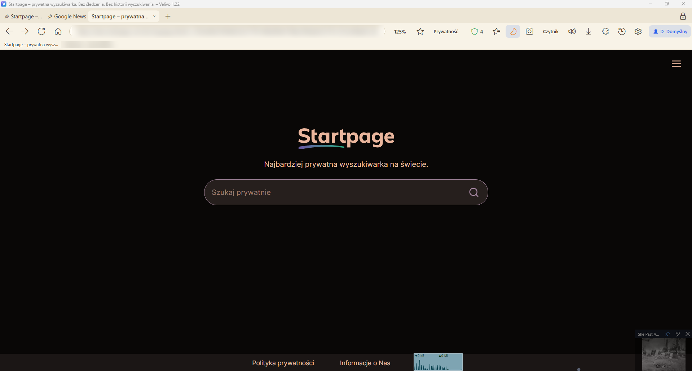
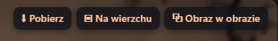
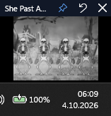
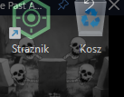
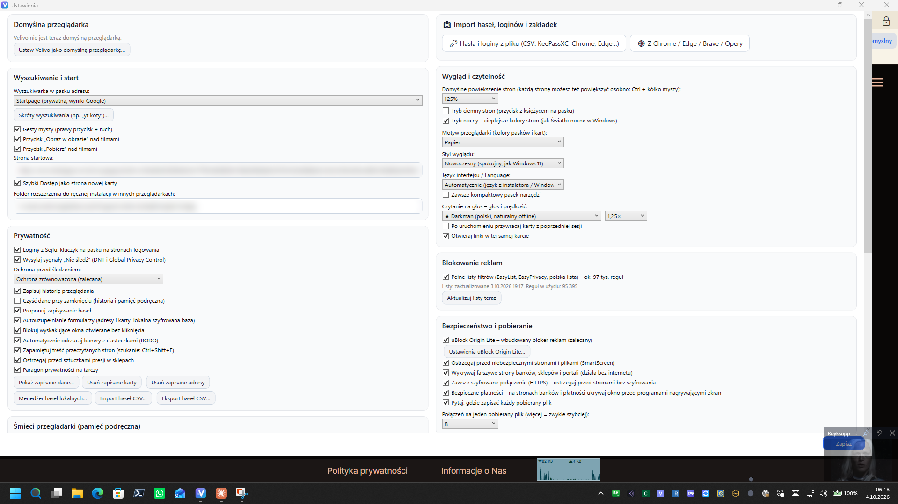
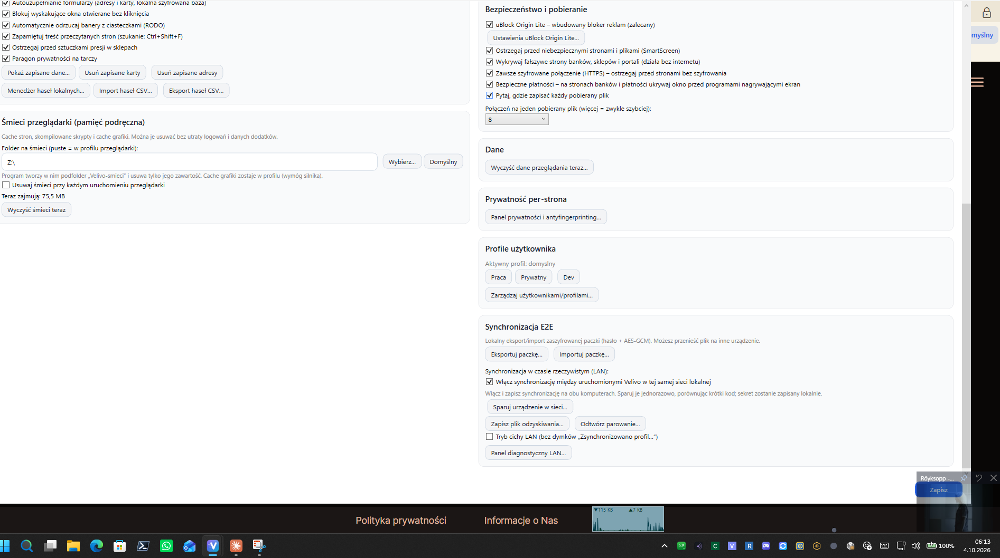

# Velivo – nowy poziom przeglądarki

## Pełny opis i instrukcja obsługi

*Stworzona z pasji. Autor: **Michael** ([github.com/mic0078](https://github.com/mic0078)).*

**Polski** | [English](MANUAL.en.md) · [Strona główna projektu](README.md)

Velivo to prywatna przeglądarka dla Windows. Twoje dane zostają u Ciebie: nie ma konta ani chmury, a historia i hasła nie trafiają na zewnętrzne serwery. Strony wyświetla silnik Microsoft Edge (WebView2), więc wyglądają i działają tak samo jak w Edge i Chrome. Wszystko wokół stron – okno, karty, menu, prywatność, pobieranie, synchronizacja – to własny kod Velivo.

Przeglądarka jest projektowana tak, żeby dało się ją w pełni obsłużyć samą myszką, także z kanapy przy telewizorze. Działa po polsku i po angielsku.

---

## Pełna lista funkcji Velivo 1.22

Lista powstała z audytu kodu (szczegóły i lokalizacje w kodzie: [docs/AUDYT-FUNKCJONALNY.md](docs/AUDYT-FUNKCJONALNY.md), porównanie z innymi przeglądarkami: [docs/PORÓWNANIE-FUNKCJI.md](docs/PORÓWNANIE-FUNKCJI.md)). **UI** = dostępne z interfejsu, **Sys.** = działa samo w tle.

### A. Tryb bankowy (`Bank.cs`)
| Funkcja | Opis | Kod | Impl. | UI | Sys. |
|---|---|---|:-:|:-:|:-:|
| Przycisk 🏦 na pasku kart | otwiera tryb, prawy klik = menu | Bank.cs ~212 | ✔ | ✔ | – |
| Odizolowany profil przeglądarki | osobny profil WebView2: cookies, logowania, bez dodatków i historii | Bank.cs 18 | ✔ | ✔ | ✔ |
| Zielone karty bankowe 🏦 | wyróżnienie kart trybu | Bank.cs | ✔ | ✔ | – |
| Czyszczenie po zamknięciu | cache i historia profilu bankowego kasowane, logowania zostają | Bank.cs 321 | ✔ | – | ✔ |
| Hasło trybu (min. 8 znaków) | PBKDF2-SHA256 600 000 iteracji | Bank.cs 209, 599 | ✔ | ✔ | – |
| Klucz sprzętowy FIDO2 | YubiKey, Titan, kilka kluczy; WebAuthn przez webauthn.dll | Bank.cs ~2490–2700 | ✔ | ✔ | – |
| Klucz sprzętowy szyfruje bazę (hmac-secret) | klucz z 🔐 sam otwiera i szyfruje bazę; HKDF | Bank.cs 120–125, 423 | ✔ | ✔ | ✔ |
| Otwieranie samym kluczem | klucz w porcie = dotknięcie zamiast hasła | Bank.cs 434 | ✔ | ✔ | – |
| Osobna zaszyfrowana baza | plik `bank*.json`, pola zaszyfrowane AES-GCM (`SealList`) | Bank.cs 127–140 | ✔ | – | ✔ |
| Automatyczna blokada po bezczynności (1–60 min) | zamyka okienka trybu | Bank.cs | ✔ | ✔ | ✔ |
| 🔒 Zablokuj teraz | natychmiastowe zamknięcie trybu | Bank.cs | ✔ | ✔ | – |
| Profile bankowe | osobny tryb dla innej osoby: własne hasło, klucz i dane | Bank.cs 27 | ✔ | ✔ | – |
| 📜 Dziennik otwarć | kiedy, na którym komputerze, czym otwarto (także złe hasła) | Bank.cs | ✔ | ✔ | ✔ |
| ⚙ Ustawienia trybu | hasło, klucze, czas blokady | Bank.cs | ✔ | ✔ | – |
| Zapomniałem hasła – wyczyść tryb | usuwa tryb i jego dane | Bank.cs | ✔ | ✔ | – |
| 💾 Kopia / 📂 Przywróć | zaszyfrowany plik `.vbank` ze wszystkimi profilami | Bank.cs | ✔ | ✔ | – |
| 🏦 Moje banki / 🛒 Moje sklepy | lista stron, otwieranie w trybie | Bank.cs | ✔ | ✔ | – |
| ➕ Dodaj tę stronę do banków / sklepów | z otwartej karty bankowej | Bank.cs | ✔ | ✔ | – |
| ✏ Dane logowania banku | login / nr klienta, passcode / PIN, hasło, memorable information | Bank.cs | ✔ | ✔ | – |
| 🔑 Wpisz login | wypełnia logowanie na stronie banku | Bank.cs | ✔ | ✔ | – |
| 🔢 Wpisz wybrane znaki | odczytuje z formularza numery znaków (2., 5., 9.) i wpisuje je, także w listach wyboru | Bank.cs | ✔ | ✔ | – |
| 🧪 Skopiuj opis formularza | opis pól bez danych, do zgłoszenia problemu | Bank.cs | ✔ | ✔ | – |
| 💳 Moje karty | numer, data, posiadacz, CVV opcjonalnie; 👁 pokaż; 📋 kopiuj | Bank.cs | ✔ | ✔ | – |
| 💳 Wypełnij kartę na tej stronie | formularz płatności | Bank.cs | ✔ | ✔ | – |
| Przypomnienie o wygasających kartach | przy otwarciu trybu | Bank.cs ~1799 | ✔ | ✔ | ✔ |
| 🔑 Moje loginy i hasła | dowolne usługi; wpis tylko na stronie z tą samą domeną; 🎲 generator | Bank.cs 1183, 1730 | ✔ | ✔ | – |
| 📄 Poufne dane | dowód, paszport, prawo jazdy, PESEL, NI number, ubezpieczenie; numer ukryty; ważność | Bank.cs 1186 | ✔ | ✔ | – |
| Przypomnienie o dokumentach (60 dni) | przy otwarciu trybu | Bank.cs ~1799 | ✔ | ✔ | ✔ |
| 🏦 Rachunki bankowe | właściciel, IBAN, sort code / BIC, bank, tytuł przelewu, 📋 | Bank.cs 1189 | ✔ | ✔ | – |
| 📝 Moje notatki | kategorie (Login, PIN, Przelewy, Kody odzyskiwania, Inne), 🎲, 🔢 znaki z numerami; okienko nie blokuje strony | Bank.cs 310 | ✔ | ✔ | – |
| 🔑 Wpisz login i hasło | z Moich loginów i haseł / Moich banków (kilka kont – wybór), gdy brak – z notatki (`login:`, `hasło:`) | Bank.cs | ✔ | ✔ | – |
| 🔗 Dane skojarzone ze stroną | login, hasło i wybrane znaki wpisywane same (jedno konto); opcja w Ustawieniach trybu | Bank.cs | ✔ | ✔ | – |
| 🛡 Strażnik przelewu | suma kontrolna IBAN / NRB, porównanie z Rachunkami bankowymi | Bank.cs | ✔ | ✔ | – |
| 💸 Wypełnij przelew | odbiorca, numer, sort code, tytuł; kwota z Rachunku do opłacenia | Bank.cs | ✔ | ✔ | – |
| 🔍 Szukaj w mojej bazie | banki, sklepy, karty, notatki | Bank.cs ~2136 | ✔ | ✔ | – |
| 🧾 Rachunki do opłacenia | kwota, termin, powtarzanie, przypomnienie, numer klienta, strona płatności, notatka | Bank.cs 1192 | ✔ | ✔ | – |
| Powtarzanie rachunków | od tygodnia do roku, jednorazowo, własne („co 10 dni”) | Bank.cs NextDue | ✔ | ✔ | ✔ |
| Przypomnienia o terminach | codziennie aż do zapłaty, także po terminie | Bank.cs ~1799 | ✔ | ✔ | ✔ |
| ✔ Zapłacone (następny termin) | wpis do historii i przesunięcie terminu; jednorazowy znika | Bank.cs ~1756 | ✔ | ✔ | – |
| 🌐 Otwórz stronę płatności | w karcie bankowej | Bank.cs | ✔ | ✔ | – |
| Nazwy rachunków z arkusza | lista wyboru w polu „Za co” | Bank.cs ~1668 | ✔ | ✔ | – |
| ➕ Dodaj rachunki z arkusza | tworzy brakujące rachunki z kolumn | Bank.cs ~1785 | ✔ | ✔ | – |
| 📊 Arkusz rachunków (w karcie) | miesiące × rachunki, sumy wierszy, kolumn i całości | Bank.cs OpenBillSheet | ✔ | ✔ | – |
| Arkusz: kolejny miesiąc z kopią kwot | ➕ Wiersz | Bank.cs (JS) | ✔ | ✔ | – |
| Arkusz: kolumny i nazwy | dodawanie, zmiana nazwy, usuwanie wierszy i kolumn | Bank.cs (JS) | ✔ | ✔ | – |
| Arkusz: import z Excela (CSV) | `;` `,` TAB, pomija „Razem”, scala miesiące, sortuje | Bank.cs (JS) | ✔ | ✔ | – |
| Arkusz: waluta | £, zł, €, $, CHF, kr, Kč, Ft, lei, ₴, ¥ – tylko symbol | Bank.cs | ✔ | ✔ | – |
| Arkusz: zapis zaszyfrowany | jednorazowy znacznik strony, adres strony sprawdzany | Bank.cs | ✔ | ✔ | ✔ |
| 📊 Zestawienie płatności (okno) | tabela, ręczne dopisywanie i usuwanie, import i eksport CSV, waluta | Bank.cs ShowBillHistory | ✔ | ✔ | – |
| Ostrzeżenie o stronie podobnej do Twojego banku | przy otwartym trybie | Bank.cs / Ochrona.cs | ✔ | ✔ | ✔ |
| Propozycja trybu bankowego | gdy bank/sklep z listy otworzysz w zwykłej karcie (po domenie głównej) | Bank.cs | ✔ | ✔ | ✔ |
| ❓ Instrukcja trybu bankowego | okno pomocy PL/EN | Bank.cs BankHelp | ✔ | ✔ | – |
| Synchronizacja trybu bankowego | zaszyfrowany pakiet, tylko między sparowanymi | LanSync.cs 703 | ✔ | – | ✔ |

### B. Hasła, Sejf, autouzupełnianie (`PasswordVault.cs`, `SejfBridge.cs`, `Autofill.cs`, `BrowserImport.cs`, rozszerzenie)
| Funkcja | Opis | Kod | Impl. | UI | Sys. |
|---|---|---|:-:|:-:|:-:|
| Menedżer haseł Velivo | lokalna baza DPAPI; lista, szukanie (domena, login, nazwa), źródło | PasswordVault.cs 16 | ✔ | ✔ | – |
| Dodaj / edytuj / usuń wpis, usuń wszystkie | | PasswordVault.cs | ✔ | ✔ | – |
| Kopiuj login / hasło, pokaż/ukryj, wklej ze schowka | | PasswordVault.cs | ✔ | ✔ | – |
| Generator mocnych haseł | kryptograficzny | PasswordVault.cs 1025 | ✔ | ✔ | – |
| Propozycja zapisu i aktualizacji hasła | po wykryciu logowania | PasswordVault.cs | ✔ | ✔ | ✔ |
| Wpisz zapisany login (wybór konta) | tylko dla prawdziwej domeny, bez dopasowania po nazwie | PasswordVault.cs 839 | ✔ | ✔ | ✔ |
| Import CSV | Chrome, Edge, KeePass, KeePassXC (pomija kosz), wieloliniowe pola | PasswordVault.cs 716, 895 | ✔ | ✔ | – |
| Eksport CSV | | PasswordVault.cs | ✔ | ✔ | – |
| Import z Chrome / Edge / Brave / Opery / Vivaldi | zakładki z plików; hasła przez stronę haseł przeglądarki | BrowserImport.cs 13 | ✔ | ✔ | – |
| Sejf: kluczyk na stronach logowania | Velivo pyta zewnętrzny Sejf (SejfMost) o loginy dla domeny | SejfBridge.cs 18 | ✔ | ✔ | ✔ |
| Sejf: sprawdzenie, że karta nadal jest na tej stronie | przed wypełnieniem | SejfBridge.cs 21 | ✔ | – | ✔ |
| Sejf: zapis loginu w zaszyfrowanym sejfie | okienko rozszerzenia | QuickAccessExtension/kod/hasla.js | ✔ | ✔ | – |
| Wypełnianie formularza z Sejfu | | formularze.js | ✔ | ✔ | – |
| Autouzupełnianie adresów i kart | DPAPI; klik w puste pole wypełnia formularz; CVC nie jest zapisywany | Autofill.cs 15, 87 | ✔ | ✔ | ✔ |
| Autouzupełnianie konta bankowego | IBAN, numer konta, sort code | Autofill.cs | ✔ | ✔ | ✔ |
| Pytanie przed wpisaniem karty i konta | potwierdzenie adresu strony | Autofill.cs | ✔ | ✔ | ✔ |
| Tylko pola widoczne dla człowieka | ukryte pola nie są wypełniane | Autofill.cs 128 | ✔ | – | ✔ |
| Pokaż zapisane dane / usuń karty / usuń adresy | | Settings.cs | ✔ | ✔ | – |
| Synchronizacja haseł | tylko w zaszyfrowanym pakiecie po sparowaniu | LanSync.cs | ✔ | – | ✔ |

### C. Sieć domowa LAN (`LanSync.cs`, `LanPairing.cs`, `LanHistorySync.cs`, `QuickAccessLanSync.cs`, `Innovations.cs §3`, `Tray.cs`)
| Funkcja | Opis | Kod | Impl. | UI | Sys. |
|---|---|---|:-:|:-:|:-:|
| Synchronizacja bez chmury | UDP 41919 w sieci lokalnej | LanSync.cs 20, 82 | ✔ | ✔ | ✔ |
| Przed sparowaniem tylko `announce` | identyfikator, nazwa komputera, profil – bez danych | LanSync.cs 647 | ✔ | – | ✔ |
| Propozycja sparowania | gdy w sieci jest drugi Velivo (pyta jeden z dwóch) | LanSync.cs OfferLanPairing | ✔ | ✔ | ✔ |
| Parowanie z kodem do porównania | uzgodnienie klucza + HMAC, krótki kod na obu ekranach, potwierdzenie | LanPairing.cs 201–310 | ✔ | ✔ | – |
| Wygasanie prób parowania, odrzucanie obcych profili | | LanPairing.cs | ✔ | – | ✔ |
| Wybór, czyje ustawienia zostają przy 1. połączeniu | zakładki, hasła, SD łączone | LanPairing.cs 321 | ✔ | ✔ | – |
| Plik odzyskiwania parowania | hasło ≥12, PBKDF2 600 tys., AES-GCM, limit 1 MB | LanPairing.cs 447 | ✔ | ✔ | – |
| Odtwórz parowanie z pliku | | LanPairing.cs 503 | ✔ | ✔ | – |
| Szyfrowanie i uwierzytelnianie pakietów | AES-GCM + HMAC-SHA256; klucze z PBKDF2 250 tys. | LanSync.cs 230–310 | ✔ | – | ✔ |
| Odrzucanie starych i powtórzonych pakietów, kontrola zegara (±5 min) | | LanSync.cs 448 | ✔ | – | ✔ |
| Kompresja GZip i limit po rozpakowaniu (8 MB) | | LanSync.cs 279, 328 | ✔ | – | ✔ |
| Izolacja profili | tylko ten sam profil; inny profil = pytanie o przełączenie | LanSync.cs 540, 614 | ✔ | ✔ | ✔ |
| Synchronizowane: ustawienia (bez lokalnych: głośniki, foldery, język…) | | LanSync.cs 68 | ✔ | – | ✔ |
| Synchronizowane: zakładki (łączone, usunięcia przez listę 90 dni) | | LanSync.cs 854 | ✔ | – | ✔ |
| Synchronizowane: hasła (łączone) | | LanSync.cs | ✔ | – | ✔ |
| Synchronizowane: reguły prywatności, profile, lista dodatków (+ automatyczna instalacja) | | LanSync.cs, Extensions.cs | ✔ | – | ✔ |
| Synchronizowane: przypięte karty | | Session.cs 39 | ✔ | – | ✔ |
| Synchronizowane: historia | łączona, usunięcia i „wyczyść wszystko” przenoszone | LanHistorySync.cs | ✔ | – | ✔ |
| Synchronizowane: tryb bankowy (wszystkie profile) | zaszyfrowany | LanSync.cs 703 | ✔ | – | ✔ |
| Synchronizowane: Szybki Dostęp z grafikami | TCP, szyfrowane, tylko od sparowanych, ochrona ścieżek | QuickAccessLanSync.cs | ✔ | – | ✔ |
| Nowsza zmiana wygrywa (ustawienia), znacznik czasu zmian | | LanSync.cs 765 | ✔ | – | ✔ |
| 📺 Wyślij do… (karta na inny komputer) | zaszyfrowane, z miejscem w filmie YouTube | Innovations.cs 404 | ✔ | ✔ | – |
| Ikona w zasobniku pulsuje przy synchronizacji | | Tray.cs, LanSync.cs TrayPulse | ✔ | ✔ | ✔ |
| Dymki „Zsynchronizowano…” | | LanSync.cs | ✔ | ✔ | ✔ |
| Tryb cichy LAN | bez dymków | Settings.cs | ✔ | ✔ | – |
| Panel diagnostyczny LAN | urządzenia, status, liczniki, log (250 wpisów), odśwież, wyczyść | LanSync.cs | ✔ | ✔ | – |
| Ostrzeżenia: różnica zegarów, za duży pakiet, błędy odbioru i nadawania | | LanSync.cs 898, 722 | ✔ | ✔ | ✔ |
| Zostań w zasobniku | zamknięcie okna = ikonka przy zegarze; menu: Otwórz, Synchronizuj teraz, Zamknij | Tray.cs | ✔ | ✔ | ✔ |
| Synchronizacja E2E plikiem | eksport i import paczki: hasło + AES-GCM, PBKDF2 600 tys. | SyncE2E.cs | ✔ | ✔ | – |

### D. Wideo (`FloatingVideo.cs`, `Extras.cs`, `DefaultBrowser.cs`)
| Funkcja | Opis | Kod | Impl. | UI | Sys. |
|---|---|---|:-:|:-:|:-:|
| ▣ Film na wierzchu | osobne okno z widokiem filmu, reszta strony ukryta | FloatingVideo.cs | ✔ | ✔ | – |
| Działa niezależnie od karty | zamknięcie karty nie zatrzymuje filmu | FloatingVideo.cs 19 | ✔ | ✔ | ✔ |
| Gra po zamknięciu głównego okna | okienko jest osobnym oknem – proces żyje, dopóki ono jest otwarte (także bez zasobnika); okno główne zamknięte, połączenia LAN i Sejfu zatrzymane | DefaultBrowser.cs 92, MainWindow.xaml.cs 113 | ✔ | ✔ | ✔ |
| Ponowne uruchomienie Velivo przy grającym tylko okienku | zamyka okienko i startuje pełne Velivo | DefaultBrowser.cs 96 | ✔ | – | ✔ |
| Zmiana rozmiaru, przeciąganie za pasek | | FloatingVideo.cs | ✔ | ✔ | – |
| Przypinka „zawsze na wierzchu” | przełącznik, zapamiętywany | FloatingVideo.cs 141 | ✔ | ✔ | – |
| Przezroczystość 15–100% | warstwa okna Windows; suwak i kółko; zapamiętywana | FloatingVideo.cs 188 | ✔ | ✔ | – |
| Zapamiętywanie pozycji i rozmiaru | z kontrolą, czy mieści się na ekranie | FloatingVideo.cs 153 | ✔ | – | ✔ |
| Pasek przewijania filmu w okienku | | FloatingVideo.cs 100 | ✔ | ✔ | – |
| YouTube: wznowienie przez odtwarzacz YT, czas w adresie | | FloatingVideo.cs 81, 219 | ✔ | – | ✔ |
| Powrót do karty | przycisk w okienku | FloatingVideo.cs | ✔ | ✔ | – |
| ⧉ Obraz w obrazie | przycisk nad filmem i w menu (największy film) | Extras.cs 373, 489 | ✔ | ✔ | – |
| Okienko PiP zachowane po zamknięciu karty | | Extras.cs 462 | ✔ | – | ✔ |
| Wyciszanie karty | | TabExtras.cs | ✔ | ✔ | – |

### E. Pobieranie (`Downloads.cs`, `VideoDownloader.cs`, `MediaDownloader.cs`, `Integrity.cs`)
| Funkcja | Opis | Kod | Impl. | UI | Sys. |
|---|---|---|:-:|:-:|:-:|
| Menedżer pobierania Velivo (jak IDM) | własne okno, lista, postęp | Downloads.cs 20 | ✔ | ✔ | – |
| Wiele połączeń (1–16) | segmenty dla plików ≥2 MB z obsługą zakresów | Downloads.cs | ✔ | ✔ | ✔ |
| Wstrzymaj / wznów | wznawianie od miejsca przerwania, gdy serwer pozwala | Downloads.cs | ✔ | ✔ | – |
| Ponawianie (5 prób, rosnące opóźnienie) | | Downloads.cs 378 | ✔ | – | ✔ |
| Cookies i przekierowania strony | pobiera zalogowany plik, ręczne przekierowania | Downloads.cs 174, 196 | ✔ | – | ✔ |
| Awaryjnie przez silnik | gdy pliku nie da się przejąć | Downloads.cs 22 | ✔ | – | ✔ |
| Pytaj, gdzie zapisać | | Settings.cs | ✔ | ✔ | – |
| Otwórz, pokaż w folderze, anuluj (usuwa część), lista zapamiętana | | Downloads.cs | ✔ | ✔ | – |
| Wbudowane okienko pobierania Edge ukryte | | MainWindow.xaml.cs 531 | ✔ | – | ✔ |
| ⬇ Pobierz nad filmem i w menu | | Extras.cs, VideoDownloader.cs | ✔ | ✔ | – |
| Wykryj media do pobrania | lista źródeł audio i wideo, pobranie jako audio | MediaDownloader.cs | ✔ | ✔ | – |
| yt-dlp | YouTube, m3u8/mpd i inne serwisy; pobierany raz, aktualizacja co 14 dni | VideoDownloader.cs | ✔ | ✔ | ✔ |
| FFmpeg | najlepsza jakość ≤1080p (MP4) i MP3 | VideoDownloader.cs | ✔ | ✔ | – |
| Tryby: najlepsza, prosta (1 plik), M4A, MP3 | | VideoDownloader.cs 206 | ✔ | ✔ | – |
| Wybór folderu filmów (zapamiętany) | | VideoDownloader.cs 97 | ✔ | ✔ | – |
| Napisy | **brak** | – | – | – | – |
| Weryfikacja SHA-256 narzędzi | yt-dlp, FFmpeg, Piper, uBOL | Integrity.cs | ✔ | – | ✔ |
| Znacznik „plik z internetu” (MOTW) | | Integrity.cs 30 | ✔ | – | ✔ |
| Separator `--` dla yt-dlp | | VideoDownloader.cs | ✔ | – | ✔ |

### F. Prywatność i bezpieczeństwo (`AdBlocker.cs`, `FilterLists.cs`, `Ubol.cs`, `PrivacyAndProfiles.cs`, `Ochrona.cs`, `Extras.cs`, `Innovations.cs`, `Identity.cs`, `ElementBlocker.cs`)
| Funkcja | Opis | Kod | Impl. | UI | Sys. |
|---|---|---|:-:|:-:|:-:|
| AdBlock Velivo | domeny w HashSet + fragmenty URL; reguły `||domena^` z EasyList | AdBlocker.cs 8 | ✔ | ✔ | ✔ |
| Pełne listy: EasyList, EasyPrivacy, polska (~97 tys. reguł) | pobierane w tle, co 4 dni, „Aktualizuj teraz” | FilterLists.cs | ✔ | ✔ | ✔ |
| Własne reguły użytkownika (`filters.txt`) | | MainWindow.xaml.cs 125 | ✔ | – | ✔ |
| uBlock Origin Lite wbudowany | + cotygodniowa aktualizacja z GitHub z SHA-256 | Ubol.cs | ✔ | ✔ | ✔ |
| Tarcza: licznik i lista zablokowanych | Velivo + uBOL bez dubli | Ubol.cs 100 | ✔ | ✔ | – |
| Włącz / wyłącz AdBlock | | Lang/okno | ✔ | ✔ | – |
| Ochrona przed śledzeniem: zrównoważona / ścisła | poziom silnika Edge wg aktywnej strony | PrivacyAndProfiles.cs 257 | ✔ | ✔ | ✔ |
| Reguły dla domen | blokuj JavaScript, bez cookies, wymuś trackery, czyść dane po wejściu | PrivacyAndProfiles.cs | ✔ | ✔ | ✔ |
| Zaufane domeny | | PrivacyAndProfiles.cs | ✔ | ✔ | – |
| Dziennik „Co zablokowano i dlaczego” | godzina, domena, powód, pełny adres | PrivacyAndProfiles.cs | ✔ | ✔ | – |
| Paragon prywatności | firmy, kraje, brokerzy danych, próby fingerprintingu (canvas, WebGL, audio) | Innovations.cs 531 | ✔ | ✔ | ✔ |
| Fingerprinting | ⚠ **wykrywanie i raport**, bez zmiany odczytów | Innovations.cs 535 | ⚠ | ✔ | ✔ |
| Ukrycie marki „WebView2” | Client Hints i `userAgentData` | Identity.cs | ✔ | – | ✔ |
| DNT + Global Privacy Control | | Settings.cs | ✔ | ✔ | ✔ |
| Odrzucanie banerów cookies | „Odrzuć” / „Tylko niezbędne”, nigdy „Akceptuj”; wyjątek per strona | Extras.cs 315 | ✔ | ✔ | ✔ |
| Blokada wyskakujących okien | | Settings.cs | ✔ | ✔ | ✔ |
| 🚫 Blokuj element | wybór myszką, kółko zmienia zakres, reguła domena+CSS, przywracanie | ElementBlocker.cs | ✔ | ✔ | – |
| Wykrywanie podróbek offline | marka na obcej domenie (lista marek), literówki, podmienione znaki | Ochrona.cs 13 | ✔ | ✔ | ✔ |
| Domeny `xn--` / litery z innych alfabetów | ostrzeżenie | Ochrona.cs | ✔ | ✔ | ✔ |
| Podróbki stron z zapisanymi hasłami | | Ochrona.cs | ✔ | ✔ | ✔ |
| Ostrzeżenie z domyślnym „Nie” + zapamiętanie prawdziwej strony | | Ochrona.cs | ✔ | ✔ | – |
| Najpierw HTTPS | strony bez szyfrowania po ostrzeżeniu | Ochrona.cs | ✔ | ✔ | ✔ |
| SmartScreen | | Settings.cs | ✔ | ✔ | ✔ |
| Bezpieczne płatności | `SetWindowDisplayAffinity` – okno niewidoczne dla nagrywania na stronach banków i płatności | Ochrona.cs 297 | ✔ | ✔ | ✔ |
| Kanał strona ↔ program ukryty, losowy znacznik uruchomienia | | Extras.cs 20, Identity.cs | ✔ | – | ✔ |
| Karty prywatne (InPrivate) | nic nie zapisują | MainWindow.xaml.cs | ✔ | ✔ | – |
| Czyść dane przy zamknięciu / wyczyść dane przeglądania | historia, cache, pobrania, cookies, formularze, hasła silnika | Settings.cs | ✔ | ✔ | – |
| Wykrywacz sztuczek presji w sklepach | liczniki, „ostatnie sztuki”, „X osób ogląda”, odznaczanie dodatków, ukryte opłaty | Innovations.cs 254 | ✔ | ✔ | ✔ |
| Siatka bezpieczeństwa błędów | błąd nie wyłącza programu, `bledy.log`, maks. 1 komunikat / 30 s | App.xaml.cs 33 | ✔ | – | ✔ |
| Ochrona przed zamknięciem okna przez silnik | | WindowClose.cs | ✔ | – | ✔ |

### G. Karty i okna (`TabExtras.cs`, `Session.cs`, `MainWindow.xaml.cs`, `Extras.cs`, `MobileView.cs`, `Zoom.cs`, `Screenshot.cs`, `ContextMenu.cs`, `History.cs`, `Features.cs`)
| Funkcja | Opis | Kod | Impl. | UI | Sys. |
|---|---|---|:-:|:-:|:-:|
| Grupy kart | nazwa, kolor, zwijanie, dodaj/usuń, rozgrupuj, zamknij grupę; zapisywane z sesją | TabExtras.cs 164 | ✔ | ✔ | – |
| Zestawy kart | zapisz otwarte, otwórz, zastąp, usuń | TabExtras.cs 94 | ✔ | ✔ | – |
| Przypięte karty | na początku paska, bez krzyżyka, po restarcie | Session.cs 61 | ✔ | ✔ | – |
| Automatyczne odświeżanie | interwały z menu karty | TabExtras.cs 57 | ✔ | ✔ | – |
| Szukaj w kartach (Ctrl+Shift+A) | | Session.cs | ✔ | ✔ | – |
| Duplikuj, zamknij inne, zamknij po prawej, przywróć zamkniętą | | Session.cs 163 | ✔ | ✔ | – |
| Przywracanie sesji | | Session.cs 10 | ✔ | ✔ | ✔ |
| Linki w tej samej karcie | Ctrl+klik = nowa karta | MainWindow.xaml.cs 401 | ✔ | ✔ | – |
| Gesty myszy | ← → ↑ ↓ ↓→ | Extras.cs 292 | ✔ | ✔ | – |
| Kółko na przyciskach | np. natężenie trybu nocnego, przezroczystość | DarkMode.cs, FloatingVideo.cs | ✔ | ✔ | – |
| Efekty wejścia stron + szybkość 0–5 s | wyostrzenie, kinowe, przyciemnienie, brak | Extras.cs 132–154 | ✔ | ✔ | – |
| Szybsze otwieranie (wczytywanie po najechaniu) | | Extras.cs 87 | ✔ | ✔ | ✔ |
| Wersja telefonu dla strony | UA Androida + Client Hints, zapamiętana | MobileView.cs | ✔ | ✔ | – |
| Powiększenie: domyślne + dla strony | przenoszone na karty z tą samą stroną | Zoom.cs | ✔ | ✔ | ✔ |
| Zrzut ekranu (widoczna część / cała strona) | `Obrazy\Zrzuty Velivo`, dymek Otwórz / Pokaż | Screenshot.cs | ✔ | ✔ | – |
| Menu prawego przycisku | wyszukaj zaznaczenie, tłumacz zaznaczenie i stronę PL↔EN, czytaj, blokuj element | ContextMenu.cs | ✔ | ✔ | – |
| Zakładki (Ctrl+D), wszystkie zakładki | | Features.cs 18 | ✔ | ✔ | – |
| Historia (Ctrl+H) | dzień → sesja → strony; szukanie; usuń wpis, dzień, sesję, całość; otwórz sesję | History.cs | ✔ | ✔ | – |
| Jedno okno programu | linki z innych programów jako nowe karty (nazwany potok) | DefaultBrowser.cs 25 | ✔ | – | ✔ |
| Domyślna przeglądarka | rejestracja i otwarcie ustawień Windows | DefaultBrowser.cs 127 | ✔ | ✔ | – |
| Skróty klawiszowe | Ctrl+T, Ctrl+Shift+N, Ctrl+W, Ctrl+Shift+T, Ctrl+H, Ctrl+J, Ctrl+D, Ctrl+Shift+A, Ctrl+Shift+F, Ctrl+Shift+U, Alt+←/→, F5, Ctrl ±/0 | Lang.cs | ✔ | ✔ | – |

### H. Czytanie (`ReaderMode.cs`, `ReadAloud.cs`, `Piper.cs`, `Innovations.cs §1`)
| Funkcja | Opis | Kod | Impl. | UI | Sys. |
|---|---|---|:-:|:-:|:-:|
| Tryb czytania | jasny / ciemny / nocny + suwak, rozmiar zapamiętany | ReaderMode.cs | ✔ | ✔ | – |
| Lokalne streszczenie | bez AI i chmury: ważenie zdań | ReaderMode.cs 241 | ✔ | ✔ | – |
| Czytanie na głos (Ctrl+Shift+U) | strona albo zaznaczenie; od miejsca prawego kliku; podświetlanie akapitu i przewijanie | ReadAloud.cs | ✔ | ✔ | – |
| Tempo, pauza / wznów, wybór głosu | automatycznie wg języka strony | ReadAloud.cs 84 | ✔ | ✔ | – |
| Piper – naturalne głosy offline | pobierane raz (~60 MB, suma SHA-256), proces w tle, podświetlanie zdań | Piper.cs | ✔ | ✔ | ✔ |
| 🧠 Gdzie ja to czytałem? (Ctrl+Shift+F) | lokalny indeks treści; pomija prywatne, banki, płatności, pocztę, strony z hasłem | Innovations.cs 26 | ✔ | ✔ | ✔ |
| Tłumaczenie (Google) | strona i zaznaczenie | ContextMenu.cs 24 | ✔ | ✔ | – |

### I. Wygląd, personalizacja, dodatki (`ModernLook.cs`, `Themes.cs`, `DarkMode.cs`, `Lang.cs`, `Settings.cs`, `QuickAccess.cs`, `Extensions.cs`, `WebStore.cs`, `Dzwiek.cs`)
| Funkcja | Opis | Kod | Impl. | UI | Sys. |
|---|---|---|:-:|:-:|:-:|
| Styl Nowoczesny / Kolorowy | ikony Windows 11, akcent | ModernLook.cs | ✔ | ✔ | – |
| 10 motywów | | Themes.cs | ✔ | ✔ | – |
| Tryb ciemny i nocny stron | zapamiętane osobno dla każdej strony; propozycja restartu silnika | DarkMode.cs 50, 177 | ✔ | ✔ | ✔ |
| Kompaktowy pasek, adaptacyjny układ, menu „…” | | MainWindow.xaml.cs | ✔ | ✔ | ✔ |
| Język PL/EN | tłumaczenie interfejsu i okien XAML | Lang.cs | ✔ | ✔ | – |
| Wyszukiwarka i skróty wyszukiwania | | Settings.cs, Extras.cs 504 | ✔ | ✔ | – |
| Strona startowa | | Settings.cs | ✔ | ✔ | – |
| Profile użytkowników Velivo | dodaj, przełącz, usuń, ikona, `--profil` | PrivacyAndProfiles.cs, App.xaml.cs | ✔ | ✔ | – |
| Szybki Dostęp: skróty i grupy | | newtab.js | ✔ | ✔ | – |
| Szybki Dostęp: miniatury stron | robione przez Velivo w niewidocznym oknie | QuickAccess.cs 249 | ✔ | ✔ | ✔ |
| Szybki Dostęp: profile z PIN-em | | newtab.js, pin.js | ✔ | ✔ | – |
| Szybki Dostęp: kosz z przywracaniem | | newtab.js | ✔ | ✔ | – |
| Szybki Dostęp: własne ikony | obrazek z pliku, wklejony, usuwanie | newtab.js | ✔ | ✔ | – |
| Szybki Dostęp: tło i rozmiar kafelków | | newtab.js | ✔ | ✔ | – |
| Szybki Dostęp: import zakładek (JSON/HTML) | | newtab.js zbierzZJson/Html | ✔ | ✔ | – |
| Szybki Dostęp: kopia na dysk, folder, nazwa komputera, sync konta Google (w Chrome) | | newtab.js, tlo.js | ✔ | ✔ | ✔ |
| Dodatki Chromium | rozpakowane, przeładowanie po zmianie kodu, okienka popup, pasek ikon, przypinanie, ustawienia dodatku | Extensions.cs, Features.cs 172 | ✔ | ✔ | ✔ |
| Instalacja z Chrome Web Store | przycisk „➕ Dodaj do Velivo”, przechwycenie `.crx` (CRX2/CRX3) | WebStore.cs | ✔ | ✔ | – |
| Głośniki Velivo | wybór wyjścia, „Nie gub dźwięku” (sprawdzanie co 2 s), mikser | Dzwiek.cs | ✔ | ✔ | ✔ |
| Dymki Velivo nad paskiem zadań | | Screenshot.cs 89 | ✔ | ✔ | ✔ |

### J. Wydajność (`Junk.cs`, `MainWindow.xaml.cs`, `Extras.cs`, `Bank.cs`)
| Funkcja | Opis | Kod | Impl. | UI | Sys. |
|---|---|---|:-:|:-:|:-:|
| Folder cache / RAM dysk | własny podfolder, czyszczona tylko jego zawartość | Junk.cs 14 | ✔ | ✔ | ✔ |
| Czyść śmieci teraz / przy starcie, rozmiar | | Junk.cs 82 | ✔ | ✔ | ✔ |
| Rozmiar pamięci podręcznej | | Settings.cs | ✔ | ✔ | ✔ |
| Filtr reklam budowany w tle i podmieniany w całości | | FilterLists.cs 23 | ✔ | – | ✔ |
| Pomijanie zdjęć i czcionek w przechwytywaniu żądań | | MainWindow.xaml.cs 425 | ✔ | – | ✔ |
| Pamięć podręczna profilu bankowego w RAM | odczyt pliku tylko po zmianie | Bank.cs 54 | ✔ | – | ✔ |
| WebView2 (silnik Edge) | wspólny z systemem | MainWindow.xaml.cs | ✔ | – | ✔ |
| Bez konta i bez chmury | | całość | ✔ | – | ✔ |
| Osobny folder danych (`PRZEGLADARKA_DANE`), log diagnostyczny (`VELIVO_DEBUG`) | | MainWindow.xaml.cs 20, 122 | ✔ | – | ✔ |

---

## Spis treści

1. [Czym Velivo różni się od innych przeglądarek](#1-czym-velivo-różni-się-od-innych-przeglądarek)
2. [Ile zajmuje i dlaczego tak mało](#2-ile-zajmuje-i-dlaczego-tak-mało)
3. [Instalacja i aktualizacja](#3-instalacja-i-aktualizacja)
4. [Pierwsze kroki – pasek narzędzi](#4-pierwsze-kroki--pasek-narzędzi)
5. [Menu prawego przycisku myszy](#5-menu-prawego-przycisku-myszy)
6. [Obsługa samą myszką: gesty i kółko](#6-obsługa-samą-myszką-gesty-i-kółko)
7. [Karty](#7-karty)
8. [Filmy: Film na wierzchu, obraz w obrazie, pobieranie](#8-filmy-film-na-wierzchu-obraz-w-obrazie-pobieranie)
9. [Prywatność i bezpieczeństwo](#9-prywatność-i-bezpieczeństwo)
10. [Zakupy: wykrywacz sztuczek presji](#10-zakupy-wykrywacz-sztuczek-presji)
11. [Czytanie: na głos, tryb czytania, „Gdzie ja to czytałem?”](#11-czytanie-na-głos-tryb-czytania-gdzie-ja-to-czytałem)
12. [Wyszukiwanie i pasek adresu](#12-wyszukiwanie-i-pasek-adresu)
13. [Wygląd: style, motywy, tryb ciemny i nocny, powiększenie](#13-wygląd-style-motywy-tryb-ciemny-i-nocny-powiększenie)
14. [Szybki Dostęp – strona nowej karty](#14-szybki-dostęp--strona-nowej-karty)
15. [Hasła i Sejf](#15-hasła-i-sejf)
16. [Tryb bankowy](#16-tryb-bankowy)
17. [Synchronizacja w sieci domowej (bez chmury)](#17-synchronizacja-w-sieci-domowej-bez-chmury)
18. [Historia i pobrane pliki](#18-historia-i-pobrane-pliki)
19. [Dodatki, profile i narzędzia](#19-dodatki-profile-i-narzędzia)
20. [Skróty klawiszowe](#20-skróty-klawiszowe)
21. [Ustawienia – co gdzie jest (każda opcja)](#21-ustawienia--co-gdzie-jest-każda-opcja)
22. [Rozwiązywanie problemów i miejsce danych](#22-rozwiązywanie-problemów-i-miejsce-danych)

---

## 1. Czym Velivo różni się od innych przeglądarek

**Velivo wykracza poza granice obecnych przeglądarek.** Chrome, Edge, Firefox i Opera **nie mają wbudowanych** poniższych funkcji. Do części z nich trzeba szukać osobnych dodatków, części nie da się zrobić wcale. W Velivo działają od razu, bez dodatków i bez konta.

| Funkcja | Co robi |
| --- | --- |
| **▣ Film na wierzchu** | Własne okienko z filmem, które zmniejszysz prawie do znaczka (od 160×90 pikseli), z **przezroczystością regulowaną kółkiem myszy** i przypinką „zawsze na wierzchu”. **Gra dalej po zamknięciu karty, a nawet całej przeglądarki.** |
| **🧠 „Gdzie ja to czytałem?”** | Znajduje przeczytany artykuł po słowach z jego **treści**, a nie tylko po tytule. Wszystko zostaje na Twoim komputerze. |
| **⚠ Wykrywacz sztuczek w sklepach** | Ostrzega przed fałszywymi licznikami, presją „ostatnie sztuki” i ukrytymi opłatami. Zaznaczone z góry dodatki w koszyku sam odznacza. |
| **🧾 Paragon prywatności** | Pokazuje, z iloma firmami i krajami łączyła się strona, którzy z nich to brokerzy danych i czy strona próbowała rozpoznać Twój komputer. |
| **📺 Wysyłanie kart w domu** | Strona, a film w tym samym miejscu, otwiera się na drugim komputerze z Velivo. Bez chmury i bez konta. |
| **Synchronizacja bez chmury** | Zakładki, hasła, historia, karty przypięte, Szybki Dostęp i ustawienia między komputerami w domowej sieci, zaszyfrowane. |
| **⬇ Pobieranie filmów jak w IDM** | Przycisk „Pobierz” nad każdym filmem, także na YouTube. Do wyboru jakość, MP3 albo M4A i folder. |
| **🔊 „Czytaj od tego miejsca”** | Prawy przycisk na akapicie i Velivo czyta od tego zdania. |
| **🌅 Tryb nocny z natężeniem** | Jak „Światło nocne” w Windows, regulowany kółkiem myszy. |
| **🛡 Ochrona przed oszustwami bez internetu** | Rozpoznaje fałszywe strony banków, sklepów i portali (`paypa1.com`, `ebay-weryfikacja.top`, litery z innych alfabetów) oraz podróbki stron, do których masz zapisane hasła – zanim strona się otworzy. |
| **💳 Bezpieczne płatności** | Na stronach banków i płatności okno Velivo staje się niewidoczne dla programów nagrywających ekran. |
| **🔐 Hasła odporne na podróbki** | Hasło trafia wyłącznie do prawdziwej domeny. Strona nie może podmienić pomocnika, „kliknąć” za Ciebie ani wyłudzić danych ukrytym polem. |
| **📥 Przeprowadzka z innej przeglądarki** | Zakładki z Chrome, Edge, Brave, Opery i Vivaldi odczytywane wprost; hasła z KeePassXC i innych przez CSV. |
| **🖱 Gesty myszy i obsługa samą myszką** | Wstecz, dalej, nowa karta, zamknięcie, odświeżanie i powiększenie – bez klawiatury. |

---

## 2. Ile zajmuje i dlaczego tak mało

| Co | Ile |
| --- | --- |
| **Instalator** `Velivo-Setup-1.22.exe` | **ok. 13 MB** (z czego ok. 6 MB to listy reguł wbudowanego uBlock Origin Lite) |
| **Program po instalacji** | ok. 30–40 MB (wraz ze składnikami Windows i dodatkiem Szybki Dostęp) |
| **Pamięć RAM samego programu Velivo** (proces `Velivo.exe`) | zwykle **50–80 MB** |
| Dla porównania: instalator Chrome lub Firefoksa | ok. 100–130 MB |

### Dlaczego instalator jest taki mały

1. **Velivo nie dźwiga własnej kopii silnika przeglądarki.** Chrome, Opera czy Brave mają w instalacji cały silnik Chromium, czyli ponad 100 MB. Velivo korzysta z silnika Microsoft Edge (WebView2), który jest już w Windows 10 i 11 i aktualizuje go Windows Update. Velivo dokłada tylko to, co własne: okno, karty, prywatność, pobieranie i synchronizację.
2. **Obudowa jest natywnym programem Windows (WPF, .NET),** a nie stroną internetową udającą program jak w Electronie. Taki kod jest bardzo zwarty.
3. **Duże dodatki pobierają się dopiero wtedy, gdy ich potrzebujesz, i tylko za Twoją zgodą:**
   - pełne listy blokowania reklam pobierają się w tle po pierwszym uruchomieniu;
   - naturalne głosy offline do czytania to ok. 60 MB na głos;
   - narzędzie yt-dlp do pobierania filmów to ok. 18 MB;
   - dodatek FFmpeg do najlepszej jakości i MP3 to ok. 140 MB do pobrania.

### Dlaczego Velivo zużywa tak mało pamięci

1. **Okno, karty, menu i paski są natywne.** Nie są zrobione ze stron internetowych, więc sama obudowa zajmuje 50–80 MB zamiast kilkuset.
2. **Reklamy i trackery są blokowane, zanim się pobiorą.** Strona ma mniej skryptów, obrazków i ramek, więc zajmuje mniej pamięci i wczytuje się szybciej.
3. **Karty w tle oddają pamięć.** Velivo informuje silnik, że karta jest w tle, a ten zwalnia część RAM-u. Muzyka i czaty w tych kartach działają dalej.
4. **Nie ma usług w tle:** brak konta, chmury, telemetrii, sugestii, zakupów i wiadomości na stronie startowej.
5. **Silnik jest współdzielony z Windows.** Część jego bibliotek system i tak trzyma w pamięci.

**Uczciwie:** te 50–80 MB to sam program Velivo. Treść otwartych stron renderuje silnik Edge w osobnych procesach `msedgewebview2.exe`, które też zajmują pamięć, jak w każdej przeglądarce. Ich zużycie zależy od tego, ile kart masz otwartych i jak ciężkie są strony. Dzięki blokowaniu reklam i usypianiu kart w tle zwykle wychodzi mniej niż w Chrome przy tych samych stronach.

---

## 3. Instalacja i aktualizacja

**Wymagania:**
- Windows 10 w wersji 1809 lub nowszej albo Windows 11, 64-bit;
- .NET 10 Desktop Runtime (x64);
- Microsoft Edge WebView2 Runtime (w Windows 11 jest zawsze).

Gdy czegoś brakuje, instalator sam to wykryje i otworzy stronę pobierania.

**Instalacja krok po kroku:**
1. Pobierz `Velivo-Setup-1.22.exe` z folderu [`Instalator`](Instalator).
2. Uruchom instalator. Gdy Windows pokaże „Nieznany wydawca”, kliknij **Więcej informacji → Uruchom mimo to**. Instalator nie ma płatnego podpisu cyfrowego.
3. **Wybierz język instalatora: Polski albo English.** Velivo uruchomi się w tym samym języku. Później zmienisz go w Ustawienia → Wygląd → Język.
4. Jeśli Velivo było już zainstalowane, wybierz:
   - **Zachowaj moje ustawienia i dane** – zwykła aktualizacja (zalecane);
   - **Czysta instalacja** – start od zera. Stare dane trafią do kopii zapasowej z dopiskiem `.kopia-<data>`.
5. Opcjonalnie zaznacz skrót na pulpicie i zakończ.

Instalacja nie wymaga uprawnień administratora. Program trafia do `%LOCALAPPDATA%\Programs\Velivo`. Instalator sam zamyka działające w tle Velivo i omija pliki zablokowane przez antywirusa.

**Ustaw jako domyślną przeglądarkę:** Ustawienia → „Ustaw jako domyślną”. Wtedy linki z innych programów otwierają się w Velivo.

---

## 4. Pierwsze kroki – pasek narzędzi

Velivo startuje na pełnym ekranie. Od lewej:

| Element | Działanie |
| --- | --- |
| **← →** | Wstecz i dalej |
| **⟳** | Odśwież (F5) |
| **⌂** | Strona startowa |
| **Pasek adresu** | Wpisz adres albo szukane słowa. Prawy przycisk daje Wytnij, Kopiuj, Wklej i **Wklej i przejdź** |
| **125%** | Powiększenie strony. **Kółko myszy nad przyciskiem** zmienia, kliknięcie przywraca domyślne. Powiększenie jest zapamiętywane osobno dla każdej strony |
| **🔑** | Pojawia się, gdy Sejf ma loginy dla tej strony; kliknięcie wypełnia logowanie |
| **☆** | Dodaj albo usuń zakładkę (Ctrl+D). Złota gwiazdka oznacza, że strona jest w zakładkach |
| **Prywatność** | Panel reguł dla bieżącej domeny |
| **Ikonki dodatków** | Dodatki Chrome. Można je przypinać i odpinać |
| **🛡 + liczba** | Tarcza: ile zablokowano na stronie. Kliknięcie pokazuje listę i paragon prywatności. Czerwona tarcza oznacza wyłączony AdBlock |
| **⚠ + liczba** (żółty) | Pojawia się w sklepie, który używa sztuczek presji |
| **📚** | Wszystkie zakładki |
| **🌙** | Tryb stron: jasny → ciemny → nocny. W trybie nocnym kółko myszy zmienia natężenie |
| **📷** | Zrzut ekranu: widoczna część albo cała strona |
| **Czytnik** | Tryb czytania ze streszczeniem |
| **🔊** | Czytaj stronę na głos. Podczas czytania pojawiają się pauza, stop i prędkość |
| **⬇** | Pobrane pliki (Ctrl+J) z liczbą trwających pobrań |
| **🧩** | Dodatki: lista z przypinaniem i „Zarządzaj dodatkami…” |
| **🕘** | Historia (Ctrl+H) |
| **⚙** | Ustawienia |
| **Profil** | Aktywny profil; kliknięcie przełącza |

Na pasku kart jest jeszcze **+** (nowa karta, Ctrl+T) i **🕶** (karta prywatna, Ctrl+Shift+N).

Na wąskim ekranie część przycisków przechodzi do menu **„…”**.

---

## 5. Menu prawego przycisku myszy

### Na stronie

Kliknij prawym przyciskiem w dowolnym miejscu strony.

| Pozycja | Kiedy jest widoczna | Działanie |
| --- | --- | --- |
| Wyszukaj „…” / Przejdź do … | Zaznaczony tekst | Wyszukuje zaznaczenie albo otwiera zaznaczony adres |
| Przetłumacz zaznaczenie / Czytaj zaznaczenie na głos | Zaznaczony tekst | Tłumaczy albo czyta zaznaczenie |
| Przetłumacz stronę na polski / angielski | Strona w innym języku | Tłumaczenie Google całej strony |
| 🚫 Blokuj element (reklamę)… | Zawsze | Wskazujesz element, który ma znikać przy każdym wejściu |
| Przywróć zablokowane elementy | Gdy coś zablokowano ręcznie | Cofa blokady na tej stronie |
| 🍪 (Nie) odrzucaj banerów ciasteczek | Zawsze | Wyjątek od automatycznego odrzucania dla tej strony |
| 📱 / 🖥 Wersja telefonu / komputerowa | Zawsze | Przełącza i zapamiętuje dla tej strony |
| ▣ Film na wierzchu · ⬇ Pobierz film · ⧉ Obraz w obrazie | Na filmie albo na YouTube | Patrz [rozdział 8](#8-filmy-film-na-wierzchu-obraz-w-obrazie-pobieranie) |
| Tryb czytania i streszczenie | Zawsze | Czysty tekst artykułu |
| Czytaj stronę na głos (Ctrl+Shift+U) | Zawsze | Czyta główną treść |
| 🔊 Czytaj od tego miejsca | Gdy nic nie jest zaznaczone | Czyta od zdania, które kliknąłeś |
| 🧠 Gdzie ja to czytałem? | Zawsze | Szukanie w treści przeczytanych stron |
| Zrzut ekranu | Zawsze | Widoczna część albo cała strona |
| Narzędzia Velivo | Zawsze | Prywatność, media, pobrane, historia, dodatki, diagnostyka sieci, profile, obraz w obrazie, szukanie w kartach |
| Dodaj do Szybkiego Dostępu | Zawsze | Skrót do wybranej grupy |

### Na karcie

Kliknij prawym przyciskiem na karcie.

- Odśwież, Duplikuj kartę
- Przypnij albo odepnij kartę
- Wycisz kartę albo włącz dźwięk
- Odświeżaj automatycznie: co 1, 5, 15 albo 30 minut
- 📺 Wyślij do… (inny komputer z Velivo w domu)
- Dodaj do grupy, Zestawy kart, Szukaj w kartach
- Zamknij kartę, inne karty albo karty po prawej (przypięte są pomijane)
- Przywróć zamkniętą kartę (Ctrl+Shift+T)

W nowoczesnym wyglądzie menu mają ikony Windows 11. W kolorowym wyglądzie mają emoji.

---

## 6. Obsługa samą myszką: gesty i kółko

### Gesty myszy

Przytrzymaj **prawy przycisk**, przesuń myszkę o ok. 3 cm i puść:

| Ruch | Działanie |
| --- | --- |
| ← w lewo | Wstecz |
| → w prawo | Dalej |
| ↑ w górę | Nowa karta |
| ↓ w dół | Zamknij kartę |
| ↓ potem → | Odśwież |

Zwykły prawy klik bez ruchu otwiera menu jak zawsze. Gesty wyłączysz w Ustawienia → Wyszukiwanie i start.

### Kółko myszy na przyciskach

| Gdzie | Działanie |
| --- | --- |
| Przycisk powiększenia (np. 125%) | Powiększa i pomniejsza stronę, zapamiętuje dla strony |
| Przycisk trybu 🌙, gdy włączony jest tryb nocny | Natężenie ocieplenia 5–100% |
| Okienko „Film na wierzchu” | Przezroczystość 15–100% |

### Klik myszką na linkach

- **Zwykły klik** otwiera w tej samej karcie (działają Wstecz i Dalej). Można to zmienić w ustawieniach.
- **Środkowy przycisk** albo **Ctrl+klik** zawsze otwiera nową kartę.

---

## 7. Karty

- **Przypinanie:** prawy przycisk na karcie → Przypnij kartę.
  - karta przechodzi na początek paska, z pinezką, bez krzyżyka;
  - jest „zamrożona” na swoim adresie: link do innej strony otwiera się w nowej karcie;
  - wraca po każdym uruchomieniu i synchronizuje się z innymi komputerami.
- **Grupy kart:** prawy przycisk → Dodaj do grupy → Nowa grupa….
  - karty grupy mają kolorową kropkę, a przed nimi stoi kolorowa etykieta;
  - kliknięcie etykiety zwija grupę do jednej etykiety z liczbą kart;
  - prawy przycisk na etykiecie: nazwa, kolor, rozgrupowanie, zamknięcie całej grupy.
- **Zestawy kart:** prawy przycisk → Zestawy kart → Zapisz otwarte karty jako zestaw…. Potem z tego samego menu otwierasz cały zestaw, zastępujesz go albo usuwasz.
- **Wyciszanie:** na karcie, która gra, pojawia się 🔊. Kliknięcie wycisza (🔇).
- **Automatyczne odświeżanie:** prawy przycisk → Odświeżaj automatycznie. Karta ma wtedy znaczek ⟳.
- **Szukanie w kartach:** Ctrl+Shift+A, wpisz kilka liter, Enter przełącza.
- **Karty prywatne (🕶):** nic nie zapisują, nie synchronizują się i nie trafiają do historii.
- **Po ponownym uruchomieniu** karty, grupy i przypięte wracają. Wyłączysz to w ustawieniach.

---

## 8. Filmy: Film na wierzchu, obraz w obrazie, pobieranie

Po najechaniu myszką na film, w jego prawym górnym rogu, pojawiają się trzy przyciski: **⬇ Pobierz · ▣ Na wierzchu · ⧉ Obraz w obrazie**. Działa to także na YouTube.

### ▣ Film na wierzchu (wyłącznie Velivo)

| Okienko z filmem | Zmniejszone w rogu ekranu | Prawie przezroczyste nad pulpitem |
| --- | --- | --- |
|  |  |  |

1. Kliknij **▣ Na wierzchu**. Film w karcie się zatrzyma, a w małym okienku ruszy od tego samego miejsca.
2. Okienko obsługujesz tak:
   - **przesuwasz** za ciemny pasek u góry;
   - **zmieniasz wielkość** za krawędź albo róg, od 160×90 pikseli;
   - **przezroczystość** zmieniasz kółkiem myszy nad okienkiem, od 15% do 100%, a na pasku widać „Widoczność 60%”;
   - **📌 przypinka:** niebieska oznacza zawsze na wierzchu, biała – zwykłe okno, które chowa się pod inne;
   - **kliknięcie na film** to pauza albo wznowienie;
   - **↩** wraca do strony w Velivo od tego samego miejsca, nawet gdy przeglądarka była zamknięta;
   - **✕** zamyka okienko.
3. Okienko **gra dalej po zamknięciu karty, a nawet całego Velivo.** Kliknięcie ikony Velivo uruchamia przeglądarkę od nowa.
4. Miejsce, wielkość, przezroczystość i przypinka są zapamiętywane.

**Czysty widok filmu.** Okienko pokazuje **sam film** na całą swoją powierzchnię – bez reszty strony: bez menu, komentarzy, podpowiedzi, okienek i banerów. Na YouTube wygląda to jak osobny odtwarzacz. Blokada reklam i trackerów działa jak w karcie, a reklamy wideo YouTube są pomijane (klik „Pomiń” albo przewinięcie wyciszonej reklamy).

**Do czego to się przydaje:**
- muzyka lub podcast w małym, półprzezroczystym okienku w rogu ekranu, podczas pracy w innych programach;
- mecz albo transmisja na żywo nad dokumentem lub arkuszem – ustaw widoczność 40–60%, a tekst pod spodem zostaje czytelny;
- poradnik wideo obok programu, w którym wykonujesz kroki;
- film gra nawet po zamknięciu Velivo, więc przeglądarka nie zajmuje pamięci.

**Obsługa samą myszką (podsumowanie):**

| Co | Jak |
| --- | --- |
| Pauza / wznowienie | klik na film |
| Przezroczystość 15–100% | kółko myszy nad okienkiem |
| Przesuwanie | ciemny pasek u góry |
| Wielkość (od 160×90) | krawędź lub róg |
| Zawsze na wierzchu | 📌 (niebieska = włączone) |
| Powrót do strony w tym samym miejscu | ↩ |
| Zamknięcie | ✕ |

Przezroczystość wymaga Windows 10 w wersji 1809 lub nowszej, bo okienko używa składnika Windows do rysowania obrazu.

### ⧉ Obraz w obrazie

Standardowe okienko silnika przeglądarki. Gra dalej po zamknięciu karty, aż zamkniesz okienko. Jego minimalną i maksymalną wielkość narzuca silnik Chromium, a nie Velivo.

### ⬇ Pobieranie filmów

1. Kliknij **⬇ Pobierz** albo prawy przycisk na filmie → **⬇ Pobierz film…**.
2. Wybierz jakość:
   - **najlepsza jakość wideo** (do 1080p, MP4);
   - **szybko** – wideo w jednym pliku, zwykle 360p–720p;
   - **tylko dźwięk M4A**;
   - **tylko dźwięk MP3**.
3. Wybierz folder (**Zmień folder…**). Velivo zapamięta ostatni.
4. Postęp, prędkość i pozostały czas widać w oknie Pobrane.

**Czym pobiera:**
- **Zwykłe pliki wideo:** menedżer Velivo, do 16 połączeń naraz.
- **YouTube, strumienie i ponad 1000 serwisów:** darmowe narzędzie **yt-dlp**:
  - pobiera się raz, za Twoją zgodą (ok. 18 MB);
  - samo aktualizuje się co 2 tygodnie;
  - pobiera po 8 kawałków naraz.
- **Najlepsza jakość i MP3** wymagają darmowego **FFmpeg** (jednorazowo ok. 140 MB, za zgodą).

**Ograniczenia:**
- Netflix, Disney+ i inne serwisy z zabezpieczeniem DRM nie są obsługiwane.
- Pobieraj tylko materiały, do których masz prawo, na przykład na własny użytek.

---

### Torrenty (opcjonalne)

Włączasz je w **Ustawienia → Torrenty** (domyślnie wyłączone). Wtedy:
- **link magnet** (kliknięty albo wklejony w pasek adresu) i **pobrany plik .torrent** pobiera darmowy program **aria2** – doinstalowany przy pierwszym użyciu, za zgodą (ok. 2,5 MB), ze sprawdzoną sumą SHA-256;
- **osobna strefa:** pliki trafiają do własnego folderu (domyślnie `Pobrane\Velivo-Torrenty`), są oznaczone jako pobrane z internetu (Windows sprawdzi je przed uruchomieniem), Velivo niczego z nich samo nie otwiera;
- w ustawieniach: folder strefy, prędkość pobierania i wysyłania, udostępnianie po pobraniu (do jakiego współczynnika, jak długo), liczba uczestników;
- postęp widać w oknie Pobrane; **zamknięcie Velivo zatrzymuje torrenty**; w trybie bankowym torrenty nie działają.

**Uwaga:** w torrentach Twój adres IP widzą inni uczestnicy wymiany – dla anonimowości użyj VPN. Udostępniaj tylko materiały, do których masz prawo.

---

## 9. Prywatność i bezpieczeństwo

| Funkcja | Opis |
| --- | --- |
| **Blokowanie reklam i trackerów** | EasyList, EasyPrivacy i lista polska, ok. 95 tys. reguł. Działa przed pobraniem, więc strony są lżejsze |
| **Ręczne blokowanie elementów** | Prawy przycisk → 🚫 Blokuj element. Kółko myszy powiększa obszar, klik blokuje, Esc anuluje |
| **🍪 Banery ciasteczek (RODO)** | Velivo samo klika „Odrzuć” albo „Tylko niezbędne”. **Nigdy nie klika „Akceptuj”.** Gdy baner nie ma przycisku odrzucenia, nic nie jest klikane |
| **Ochrona przed śledzeniem** | Zrównoważona (domyślna) albo ścisła. Na zaufanych stronach ścisła działa jak zrównoważona, chyba że zaznaczysz „Wymuś blokowanie trackerów” |
| **Reguły dla domen** (przycisk Prywatność) | Blokada JavaScriptu, ciasteczek, wymuszone blokowanie trackerów, automatyczne czyszczenie danych, zaufana domena |
| **🛡 Tarcza** | Licznik i lista wszystkiego, co zablokowano: AdBlock, reguły, JavaScript, ręcznie ukryte elementy, banery ciasteczek |
| **🧾 Paragon prywatności** | Na górze okna tarczy: ile zewnętrznych firm, w ilu krajach, brokerzy danych, próby rozpoznania komputera (canvas, karta graficzna, dźwięk) i najczęstsze firmy |
| **„Nie śledź”** | Wysyła sygnały DNT i Global Privacy Control |
| **SmartScreen** | Ochrona Microsoft przed groźnymi stronami i plikami, pomijana na zaufanych domenach |
| **🛡 Wykrywanie podróbek** (bez internetu) | Przed otwarciem strony sprawdza, czy adres nie udaje banku, sklepu lub portalu: marka na obcej domenie (`paypal-secure-login.com`, `ebay.co.uk.konto.top`), literówki i podmienione znaki (`paypa1.com`, `rnicrosoft.com`, `amaz0n.com`), adresy `xn--` z literami z innych alfabetów i podróbki stron, do których masz zapisane hasła. Pokazuje ostrzeżenie z domyślną odpowiedzią „Nie”. Jeśli to prawdziwa strona, wybierz „Tak” – Velivo zapamięta ją |
| **🔒 Zawsze HTTPS** | Każde połączenie najpierw szyfrowane. Strona bez szyfrowania otwiera się dopiero po ostrzeżeniu, żeby nie wpisywać tam haseł ani karty |
| **💳 Bezpieczne płatności** | Na stronach banków i płatności (PayPal, Monzo, Revolut, Barclays, HSBC, Lloyds, NatWest, Santander, PKO, mBank, Stripe i inne) okno Velivo jest niewidoczne dla programów nagrywających ekran. Pojawia się komunikat 🛡. Na tych stronach nie zrobisz zrzutu ekranu |
| **🔐 Hasła i formularze odporne na ataki** | Hasło tylko dla prawdziwej domeny; pomocnik Velivo niepodmienialny przez stronę; działają tylko prawdziwe kliknięcia myszą; ukryte pola nie są wypełniane; przed wpisaniem karty lub konta bankowego Velivo pyta; kod CVC nigdy nie jest zapisywany |
| **Karty prywatne** | Osobne, izolowane dane, które znikają po zamknięciu. Hasła i formularze działają, a zapis – tylko po Twojej zgodzie |
| **Czyszczenie danych** | Przy zamknięciu albo ręcznie w ustawieniach |

Wszystkie przełączniki są w Ustawieniach → „Bezpieczeństwo i pobieranie”. Testy ataków są w repozytorium w `testy/bezpieczenstwo/`.

**Uczciwie:** Velivo chroni w przeglądarce. Wirusy i programy szpiegujące w samym systemie wykrywa antywirus (np. Windows Defender lub Bitdefender) – zostaw go włączonego.

---

## 10. Zakupy: wykrywacz sztuczek presji

Gdy sklep próbuje Cię popędzić, obok tarczy zapala się żółty przycisk **⚠ liczba**. Po kliknięciu widzisz listę:

- **⏱ licznik czasu.** Jeśli po odświeżeniu strony liczy od nowa, Velivo oznacza go jako **fałszywy**;
- **📦 „tylko 2 sztuki”, „zostało 3 miejsca”;**
- **👥 „15 osób ogląda teraz”, „ktoś właśnie kupił”;**
- **☑ zaznaczone z góry ubezpieczenie, gwarancja albo newsletter w koszyku.** Velivo je **odznacza**;
- **💸 opłata serwisowa, manipulacyjna albo rezerwacyjna,** która pojawia się dopiero przy zamówieniu.

Wykrywacz czyta teksty i zachowanie strony, więc nie wyłapie każdego sklepu i rzadko może się pomylić.

---

## 11. Czytanie: na głos, tryb czytania, „Gdzie ja to czytałem?”

### Czytanie na głos

- **🔊 na pasku** albo Ctrl+Shift+U czyta główną treść strony. Czytany akapit jest podświetlony i przewijany na środek ekranu.
- **Prawy przycisk → 🔊 Czytaj od tego miejsca** czyta od klikniętego zdania. Klik w inne miejsce przeskakuje tam.
- **Zaznacz tekst → Czytaj zaznaczenie na głos** czyta tylko fragment.
- Podczas czytania na pasku są pauza, stop i prędkość (0,75×–2×), a w ustawieniach jest głośność.
- **Głosy:**
  - polskie i angielskie głosy Windows;
  - naturalne głosy offline Piper: Gosia, Darkman, MC Speech, Lessac, Ryan, Alba. Każdy pobiera się raz, ok. 60 MB.
- **Pomijane przy czytaniu:**
  - menu, stopki i reklamy;
  - bloki „Czytaj także”, „Polecamy” i listy linków;
  - komentarze, newslettery i podpisy zdjęć.

### Tryb czytania (przycisk „Czytnik”)

- Czysty tekst artykułu w czytelnej czcionce, bez reklam i rozpraszaczy.
- **„Najważniejsze zdania”** – automatyczne streszczenie liczone lokalnie, **bez AI i bez chmury**. Velivo wybiera zdania z najważniejszymi słowami artykułu i tytułu, z premią za początek tekstu.
- Przyciski „Czytaj podsumowanie” i „Czytaj całość”. Kliknięcie w tekst czyta od tego miejsca.

### 🧠 „Gdzie ja to czytałem?” (Ctrl+Shift+F)

- Velivo zapamiętuje tekst przeczytanych stron, **tylko na tym komputerze**.
- Wpisujesz słowa, które pamiętasz z treści, na przykład „bateria laptop 6 godzin”. Wielkość liter i polskie znaki nie mają znaczenia.
- Wyniki pokazują tytuł, stronę, datę i fragment z szukanymi słowami. Dwuklik otwiera stronę.
- **Pomijane:** karty prywatne, banki, płatności, poczta, logowania, gov.pl, ZUS i każda strona z polem hasła.
- **Gdzie to otworzyć:** prawy przycisk na stronie, przycisk w oknie Historii albo Narzędzia Velivo.
- Wyczyszczenie historii czyści także tę pamięć. Funkcję wyłączysz w ustawieniach.

---

## 12. Wyszukiwanie i pasek adresu

- **Wpisz słowa** zamiast adresu, a Velivo wyszuka je w wybranej wyszukiwarce (Ustawienia → Wyszukiwanie i start).
- **Skróty wyszukiwania:** wpisz skrót, spację i hasło:

| Wpisz | Szuka w |
| --- | --- |
| `yt koty` | YouTube |
| `g przepis` | Google |
| `ddg pogoda` | DuckDuckGo |
| `wiki Kraków` | Wikipedia (PL) |
| `allegro rower` | Allegro |
| `olx kanapa` | OLX |
| `ceneo telewizor` | Ceneo |
| `mapy Gdańsk` | Mapy Google |
| `filmweb Matrix` | Filmweb |
| `tlumacz hello` | Tłumacz Google |

  Własne skróty dodasz w Ustawienia → Wyszukiwanie i start → **Skróty wyszukiwania…**, na przykład `skrót=adres z %s`.
- **Prawy przycisk na pasku adresu → Wklej i przejdź** wkleja i od razu otwiera.

---

## 13. Wygląd: style, motywy, tryb ciemny i nocny, powiększenie

- **Styl** (Ustawienia → Wygląd):
  - **Nowoczesny** (domyślny): spokojne przyciski bez kolorowych teł, ikony Windows 11, jeden niebieski akcent, a kolor tylko przy najechaniu albo gdy coś jest włączone;
  - **Kolorowy**: kolorowe przyciski i emoji.
- **10 motywów:** Jasny, Grafit, Granat, Nocny fiolet, Las, Ocean, Zachód słońca, Czerń (OLED), Papier, Mgła.
- **Tryby stron** (przycisk 🌙):
  - jasny;
  - **ciemny** – strony przyciemnione, a zdjęcia zostają w prawdziwych kolorach;
  - **nocny** – ciepłe kolory i mniej niebieskiego światła, **natężenie kółkiem myszy**.
- **Powiększenie** zapamiętywane dla każdej strony, zmieniane kółkiem na przycisku procentów albo Ctrl+kółkiem.
- **Wersja telefonu** dla wybranej strony (prawy przycisk), zapamiętywana.
- **Język:** polski albo angielski (Ustawienia → Wygląd → Język).
- **Efekt wejścia treści:** nowa strona pojawia się z wyostrzenia, z ciemności (kinowo), z delikatnym przyciemnieniem albo od razu; szybkość od 0 do 5 s (Ustawienia → Wygląd). Szczegóły w rozdziale 21.
- **Tryb czytania** ma własny wygląd: ☀ jasny, 🌙 ciemny albo 🌅 nocny z suwakiem natężenia.

---

## 14. Szybki Dostęp – strona nowej karty

- Skróty ułożone w grupach, na przykład Start, Finanse, Muzyka, Gry.
- Ikony stron i **miniatury stron** robione w tle. Ikony nie migają przy przełączaniu grup.
- **Profile Szybkiego Dostępu**, opcjonalnie z PIN-em, oraz **motywy tła**.
- Dodawanie: przycisk **+ Skrót**, prawy przycisk na stronie → „Dodaj do Szybkiego Dostępu” albo import zakładek.
- Synchronizacja z innymi komputerami w domu: skróty i grupy są łączone.

---

## 15. Hasła i Sejf

- **Sejf** (osobny program autora) przechowuje hasła zaszyfrowane offline. Gdy strona ma pole logowania, na pasku pojawia się **🔑**, a kliknięcie wypełnia formularz.
- **Zapis do Sejfu:** po zalogowaniu Velivo pyta, czy zapisać albo zaktualizować hasło.
- **Własna zaszyfrowana baza Velivo** (Menedżer haseł lokalnych) z **generatorem silnych haseł**.
- **Import i eksport CSV**, na przykład z KeePassXC albo Chrome.
- **Import z Chrome/Edge/Brave/Opery/Vivaldi** (Ustawienia → „Importuj z Chrome/Edge/Brave…”): zakładki Velivo odczytuje samo, z każdego profilu. Hasła przenosisz przez plik CSV: przycisk otwiera stronę eksportu haseł w tamtej przeglądarce, potem „Wczytaj plik CSV…”, a na koniec usuń plik CSV.
- **Ważne:** zrób import, **zanim** odinstalujesz starą przeglądarkę. Po jej usunięciu zakładek nie da się odczytać, a haseł wyeksportować. Hasła z konta Google można też pobrać później ze strony passwords.google.com. Logowania do stron się nie przenoszą – zaloguj się raz w Velivo.
- **Przyciski przy polu logowania:** obok pola, po prawej, pojawia się plakietka **🔑 Wpisz · ⚡ Generuj**:
  - **🔑 Wpisz** pokazuje listę kont tej strony (nazwa i e-mail); klik wpisuje login i hasło. Na końcu listy jest **🔎 Inne konto z bazy Velivo…** – okno z wyszukiwarką całej bazy (np. logowanie kontem PreSonus na stronie Fendera). Okno pokazuje adres strony i ostrzega przed podróbkami;
  - **⚡ Generuj** wpisuje silne, losowe hasło.
- **Pytanie o zapis:** po kliknięciu „Zaloguj”, Enterze lub wysłaniu formularza Velivo pyta, czy zapisać lub zaktualizować hasło. Działa też w kartach prywatnych.
- **Menedżer haseł:** wyszukiwarka, kopiowanie loginu i hasła, edycja, eksport. Wpisy z KeePassXC i telefonu bez adresu dostają domenę z tytułu lub linku aplikacji (`android://…`), a dwuklik otwiera stronę i wypełnia formularz.
- **Autouzupełnianie** (lokalna, szyfrowana baza): **adres** (imię, nazwisko, ulica, kod, miasto, telefon, e-mail), **karta** (bez CVC) i **konto bankowe** (IBAN, numer konta, sort code). Klik w puste pole wypełnia cały formularz – na każdej stronie https. Kartę i konto Velivo wpisuje dopiero po potwierdzeniu adresu strony.

---

## 16. Tryb bankowy

Tryb bankowy to osobny, odizolowany profil przeglądarki na banki, płatności i zakupy, z własną **zaszyfrowaną bazą**. Zwykłe karty nic z niego nie widzą i odwrotnie. Nie ma w nim dodatków ani historii, a po zamknięciu znika pamięć podręczna (logowania i „zapamiętaj mnie” zostają).

**Otwieranie i ustawienia**

- Zielony przycisk **🏦** na pasku kart. Za pierwszym razem ustawiasz **hasło** (min. 8 znaków), a opcjonalnie **klucz sprzętowy** (YubiKey, Google Titan i inne klucze FIDO2): zaznacz „Dodatkowo wymagaj klucza sprzętowego”, włóż klucz i kliknij **„➕ Dodaj klucz”** – Windows poprosi o dotknięcie dwa razy. Wszystkie swoje klucze dodaj w tym samym okienku, potem **„Zapisz”**.
- **Klucz w porcie** – Velivo od razu prosi o dotknięcie, hasło niepotrzebne. **Bez klucza** – wpisujesz hasło. Klucz oznaczony **🔐** sam otwiera tryb i szyfruje bazę.
- Karty bankowe są zielone i mają ikonę 🏦. Tryb **blokuje się sam** po bezczynności (do wyboru 1–60 min) i zamyka wtedy wszystkie swoje okienka.
- Wszystko jest pod **prawym przyciskiem na 🏦**. Tam też jest **❓ Instrukcja trybu bankowego**.

**Moje banki i Moje sklepy online**

- **🏦 Moje banki / 🛒 Moje sklepy online** – lista Twoich stron; kliknięcie otwiera stronę w trybie bankowym.
- Dodawanie: **„➕ Dodaj tę stronę do Moich banków / sklepów”** na otwartej karcie bankowej albo **„➕ Dodaj bank / sklep (nazwa i adres)…”** na liście.
- **✏ Dane logowania** (w Moich bankach): login / numer klienta, passcode / PIN, hasło i memorable information – osobno dla każdego banku. Wpisuj zawsze **pełne** hasło i passcode.
- **🔑 Wpisz login** – wypełnia login i hasło na stronie banku.
- **🔢 Wpisz wybrane znaki** – gdy bank prosi np. o 2., 5. i 9. znak (RBS, NatWest, Bank of Scotland, TSB, Lloyds, Halifax), Velivo samo odczytuje numery i wpisuje właściwe znaki, także w listach wyboru. Gdy na jakiejś stronie się nie uda, **🧪 Skopiuj opis formularza** kopiuje sam opis pól (bez Twoich danych) do zgłoszenia.
- **🔗 Dane skojarzone ze stroną** – na stronie z Twojej bazy login, hasło i wybrane znaki wpisują się same (gdy pasuje jedno konto; formularza Velivo nie wysyła). Kilka kont (np. prywatne i firmowe) – wybór jednym kliknięciem; karta płatnicza – zawsze po kliknięciu. Można wyłączyć w Ustawieniach trybu bankowego.
- **🔒 Pełna izolacja** – tryb bankowy używa tylko własnej zaszyfrowanej bazy: zwykłe hasła i autouzupełnianie przeglądarki nie są w nim podpowiadane ani zapisywane, a dane z bazy trafiają wyłącznie do kart bankowych (bez dodatków).
- **🛡 Strażnik przelewu** – wklejony lub wpisany numer rachunku Velivo sprawdza (suma kontrolna IBAN / NRB) i porównuje z Twoimi Rachunkami bankowymi: literówka, numer podmieniony w schowku przez wirusa albo obcy odbiorca widać od razu.
- **💸 Przelew z bazy** – na formularzu przelewu Velivo wpisuje odbiorcę, numer rachunku (NRB / IBAN / sort code + 8 cyfr), tytuł, a kwotę i numer klienta z Rachunku do opłacenia o tej samej nazwie. Zatwierdzasz zawsze sam.

**Karty, notatki i wyszukiwarka**

- **💳 Moje karty** – kliknij kartę, żeby zobaczyć i zmienić dane; **„👁 Pokaż numer i CVV”** odsłania ukryte pola. CVV jest opcjonalne. Przyciski **📋 Kopiuj numer / datę / CVV** – schowek czyści się sam po 30 s. **💳 Wypełnij kartę na tej stronie** wpisuje dane w formularzu płatności. Przy otwarciu trybu Velivo przypomina o kartach, które niedługo wygasają.
- **📝 Moje notatki** – loginy, hasła, numery klienta, z kategoriami (Login, PIN, Przelewy, Kody odzyskiwania, Inne). **🎲 Wygeneruj hasło** wstawia mocne hasło, **🔢 Znaki z numerami** pokazuje hasło znak po znaku z numerami. Okienka notatek i wyszukiwarki nie blokują strony.
- **🔍 Szukaj w mojej bazie** – jedno pole dla banków, sklepów, kart i notatek.

**🔑 Moje loginy i hasła**

- Dla każdej usługi spoza banków (poczta, sklepy, Netflix, urzędy…): *Nazwa*, *Login*, *Hasło* (ukryte – odsłania je „👁 Pokaż ukryte dane”), *Adres strony www*, *Notatka*. Przy każdym polu **📋** kopiuje (schowek czyści się po 30 s).
- **🌐 Otwórz stronę** – otwiera adres w karcie. **🔑 Wpisz na otwartej stronie** – wpisuje login i hasło, ale **tylko na stronie o tym samym adresie (domenie)** – na fałszywą stronę hasło nie trafi. **🎲 Wygeneruj hasło** – wstawia mocne, 20-znakowe hasło i kopiuje je.

**📄 Poufne dane (dokumenty)**

- *Rodzaj dokumentu* (dowód osobisty, paszport, prawo jazdy, PESEL, NI number, ubezpieczenie zdrowotne, inny), *Imię i nazwisko*, *Numer* (ukryty), *Ważny do* (DD.MM.RRRR), *Notatka*.
- Przy otwarciu trybu bankowego Velivo **przypomina o dokumentach, którym ważność kończy się w ciągu 60 dni**.

**🏦 Rachunki bankowe**

- Twoje konta i konta odbiorców (np. właściciel mieszkania): *Nazwa*, *Właściciel rachunku*, *Numer rachunku / IBAN* (ukryty), *Sort code / BIC (SWIFT)*, *Bank*, *Tytuł przelewu / notatka*. Przyciski **📋** pozwalają przepisać dane do przelewu bez pomyłek.

**🧾 Rachunki do opłacenia**

Lista stałych i jednorazowych opłat (czynsz, prąd, ogrzewanie, council tax, internet, raty…) – zaszyfrowana razem z resztą bazy. Otwierasz ją z menu **🏦 → 🧾 Rachunki do opłacenia**.

- **Pola rachunku:** *Za co* (nazwa), *Kwota*, *Termin płatności* (DD.MM.RRRR), *Powtarzanie* (co tydzień, co 2 tygodnie, co 4 tygodnie, co miesiąc, co 2 miesiące, co kwartał, co pół roku, co rok, jednorazowo – albo wpisz własne, np. „co 10 dni”), *Przypominaj dni wcześniej*, *Numer klienta / referencja*, *Strona do płatności*, *Notatka*. Przy każdym polu jest **📋** do skopiowania (schowek czyści się po 30 s).
- **Nazwa z arkusza:** pole *Za co* ma rozwijaną listę nazw kolumn z arkusza rachunków (np. „Housing Rata 1”, „Council Rata 2”). Wybieraj nazwę z listy – dzięki temu zapłacone rachunki trafiają do właściwej kolumny arkusza. Inna nazwa (nawet literówka) = nowa kolumna w arkuszu.
- **➕ Dodaj jako nową / ✔ Zmień zaznaczoną / Usuń zaznaczoną / Wyczyść pola** – zwykła edycja listy. Na końcu kliknij **Zapisz** – dopiero wtedy zmiany (także oznaczone płatności) trafiają do zaszyfrowanej bazy.
- **✔ Zapłacone (następny termin)** – zaznacz rachunek i kliknij: płatność zapisuje się w historii (miesiąc = miesiąc terminu, kwota z rachunku), a termin przesuwa się wg powtarzania. Rachunek jednorazowy po opłaceniu znika z listy. Kliknięcie dwa razy w tym samym miesiącu doda kwotę dwa razy – pomyłkę poprawisz w arkuszu.
- **➕ Dodaj rachunki z arkusza** – dodaje na listę każdą kolumnę arkusza, której jeszcze nie ma: kwota z ostatniego miesiąca, powtarzanie *co miesiąc*, termin 1. dnia następnego miesiąca. **Popraw potem dzień terminu** na prawdziwy i kliknij **Zapisz**.
- **🌐 Otwórz stronę płatności** – otwiera adres z pola *Strona do płatności* w karcie bankowej.
- **Przypomnienia:** przy otwarciu trybu bankowego Velivo pokazuje rachunki z terminem w ciągu kilku dni i po terminie – codziennie, aż oznaczysz je jako zapłacone.
- Velivo **nie łączy się z bankiem** – nie wie samo, że zapłaciłeś. Płatność oznaczasz przyciskiem *Zapłacone*.

**📊 Arkusz rachunków**

Zestawienie wszystkich zapłaconych rachunków jak w Excelu, otwierane w karcie bankowej (lokalnie, bez internetu). Przycisk **📊 Arkusz rachunków (w karcie)** w okienku *Rachunki do opłacenia*.

- **Jak czytać:** każdy **wiersz** to miesiąc, każda **kolumna** to rachunek, w komórce kwota zapłacona w tym miesiącu. Kolumna **Razem** po prawej = suma miesiąca, wiersz **Razem** na dole = suma każdego rachunku ze wszystkich miesięcy, w prawym dolnym rogu suma całości.
- **Wpisywanie:** klikasz komórkę i wpisujesz kwotę – sumy liczą się od razu. Miesiąc wpisujesz słownie lub liczbowo: „październik 2026”, „October 2026”, „10.2026”, „2026-10”.
- **➕ Wiersz (miesiąc)** – dodaje miesiąc następny po najpóźniejszym w tabeli (po wrześniu 2026 → październik 2026) i kopiuje kwoty z ostatniego wiersza (stałe opłaty nie trzeba wpisywać od nowa).
- **➕ Kolumna (rachunek)** – nowy rachunek; nazwę zmieniasz klikając w nagłówek. **✕** pod nazwą usuwa kolumnę, **✕** na końcu wiersza usuwa miesiąc.
- **📤 Wczytaj z Excela (CSV)** – w Excelu: *Plik → Zapisz jako → CSV (rozdzielany przecinkami/średnikami)*. Układ pliku: **pierwsza kolumna = miesiąc**, **pierwszy wiersz = nazwy rachunków**, w środku kwoty. Separator (`;`, `,` lub tabulator) Velivo rozpoznaje samo. Kolumny i wiersze o nazwie *Razem / Suma / Total* są pomijane (żeby sumy nie liczyły się podwójnie). Miesiące, które już są w arkuszu, zostają uzupełnione (puste komórki z pliku nie kasują Twoich kwot), nowe rachunki dochodzą jako nowe kolumny, a wiersze układają się chronologicznie. Po wczytaniu pojawia się liczba wczytanych wierszy.
- **Waluta, w której wpisujesz kwoty** – £, zł, €, $, CHF, kr, Kč, Ft, lei, ₴, ¥. To tylko **symbol** – kwoty **nie są przeliczane** po kursie. Domyślnie waluta z ustawień regionalnych Windows; wybór zapamiętuje się po *Zapisz i zamknij*.
- **💾 Zapisz i zamknij** – dane szyfrują się w bazie i karta się zamyka. Wiersze bez kwot są pomijane, wiersze bez poprawnego miesiąca też (Velivo poda ile). **Anuluj** zamyka bez zapisywania.
- **Związek z Rachunkami do opłacenia:** arkusz i przycisk *Zapłacone* korzystają z tej samej historii. Każde *Zapłacone* pojawia się w arkuszu w miesiącu terminu i w kolumnie o tej samej nazwie.
- Starsze okienko **📊 Zestawienie płatności** pokazuje te same dane jako tabelę, z ręcznym dopisywaniem/usuwaniem płatności i **📥 Zapisz do Excela (CSV)** (eksport).

**Ochrona**

- **Fałszywe strony:** gdy przy otwartym trybie bankowym wejdziesz na stronę podobną do Twojego banku (np. inny adres z nazwą banku), pojawi się duże ostrzeżenie.
- **Bank w zwykłej karcie:** gdy otworzysz bank, sklep lub stronę płatności z listy w zwykłej karcie, w okienku nad paskiem zadań pojawi się pytanie **„Przełącz na tryb bankowy”** / **„Zostań tutaj”**. Rozpoznawanie działa po domenie głównej, także dla innych adresów tej samej firmy.
- **📜 Dziennik otwarć** – kiedy, na którym komputerze i czym otwarto tryb (także złe hasła).

**Profile, kopia i synchronizacja**

- **👤 Profile bankowe** – osobny tryb dla innej osoby: własne hasło lub klucz, osobne logowania i dane.
- **💾 Kopia zapasowa** i **📂 Przywróć z kopii** – plik `.vbank` ze wszystkimi profilami, nadal zaszyfrowany (np. na pendrive).
- **Synchronizacja** – banki, sklepy, karty, notatki i ustawienia trybu przechodzą na sparowane komputery w szyfrowanym pakiecie. Logowania do banków (ciasteczka) zostają na każdym komputerze osobno.
- **Zapomniane hasło:** bez hasła i bez klucza danych nie da się odczytać. **„Zapomniałem hasła – wyczyść tryb bankowy”** usuwa tryb i jego dane na tym komputerze – dlatego warto mieć drugi klucz i kopię zapasową.

---

## 17. Synchronizacja w sieci domowej (bez chmury)

### Parowanie (raz)

1. Zainstaluj tę samą wersję Velivo na obu komputerach.
2. Ustaw na obu **ten sam profil** (Ustawienia → Profile użytkownika).
3. Zaznacz „Włącz synchronizację między uruchomionymi Velivo”. Zapora Windows musi przepuszczać Velivo (port 41919).
4. Velivo zapyta: „Połączyć oba komputery…?” Wybierz **Tak** albo kliknij „Sparuj urządzenie w sieci…”.
5. Porównaj krótki kod na obu ekranach i potwierdź.
6. Wybierz, czyje ustawienia zachować.

Od tej chwili wszystko idzie **zaszyfrowane, przez Twoją sieć, bez internetu**.

### Co się synchronizuje

| Dane | Jak |
| --- | --- |
| Zakładki | Suma z obu; usunięcie działa na obu |
| Hasła Velivo | Suma; przy tym samym koncie wygrywa nowsze |
| Historia (ostatnie 60 dni) | Suma; usunięcie wpisu, dnia albo całości działa na obu |
| Karty przypięte | Wygrywa ostatnia zmiana |
| Szybki Dostęp | Skróty i grupy łączone |
| Ustawienia, prywatność, profile, dodatki | Wygrywa ostatnia zmiana; świeża instalacja nie nadpisuje danych |
| Język, foldery, okienko filmu | **Nie** – każdy komputer ma swoje |
| Pozostałe otwarte karty | **Nie** – zamiast tego prawy przycisk na karcie → 📺 Wyślij do… |

### 📺 Wysyłanie kart

Prawy przycisk na karcie → **📺 Wyślij do… → nazwa komputera**. Na drugim komputerze strona otwiera się w nowej karcie, a okno wychodzi na wierzch. Film rusza od tego samego miejsca.

Stan połączenia pokazuje Ustawienia → **Panel diagnostyczny LAN…**.

---

## 18. Historia i pobrane pliki

### Historia (Ctrl+H)

- Ułożona **dzień → witryna → podstrony**, na przykład „Wczoraj · 180 stron · 12 witryn”, a w nim „polsatnews.pl · 45 stron”.
- Powtórzone wizyty są pokazane raz, z dopiskiem ×3. Wpisy Szybkiego Dostępu są ukryte.
- **Prawy przycisk:** otwórz, otwórz w nowej karcie, otwórz wszystkie strony witryny, usuń wpis, witrynę albo dzień.
- Wyszukiwanie po tytułach i adresach oraz przycisk **🧠 Szukaj w treści stron…**.

### Pobrane (Ctrl+J)

- **Menedżer Velivo:** do 16 połączeń, pauza i **wznawianie po ponownym uruchomieniu**, ponawianie po zerwaniu połączenia.
- **Historia pobranych zostaje po ponownym uruchomieniu.** Przy każdym pliku widać rozmiar, datę i godzinę oraz stronę, z której pochodzi.
- Usunięty plik ma szary napis „Plik usunięty lub przeniesiony”.
- Przyciski: Otwórz, 📁 Pokaż w folderze, Usuń z listy, Wyczyść zakończone, Media na stronie.

---

## 19. Dodatki, profile i narzędzia

- **Dodatki Chrome:** instalacja z Chrome Web Store, z linku albo rozpakowanego folderu.
  - przycisk 🧩 pokazuje listę dodatków z pinezką: przypięte mają ikonkę na pasku, odpięte działają dalej, tylko bez ikonki;
  - prawy przycisk na ikonce dodatku → Odepnij z paska.
- **Profile użytkowników:** osobne dane dla osoby albo celu, na przykład praca czy prywatny.
- **Zrzuty ekranu:** widoczna część albo cała strona z przewijaniem.
- **Tłumaczenie:** całej strony albo zaznaczenia (Tłumacz Google).
- **Wykrywanie mediów do pobrania** na stronie (Narzędzia Velivo).

### 🛡 uBlock Origin Lite (wbudowany)

- Dołączony do instalatora i **włączany automatycznie** – nie trzeba go dodawać.
- Ustawienia → „Bezpieczeństwo i pobieranie”: przełącznik i przycisk **„Ustawienia uBlock Origin Lite…”** (tryb filtrowania, listy, wyjątki dla stron).
- To, co zablokuje, wlicza się do **licznika na tarczy** i pojawia się na jej liście. Podpowiedź tarczy pokazuje osobno „w tym uBlock Origin Lite: N”.
- **Aktualizuje się sam** raz w tygodniu z oficjalnego GitHuba twórców. Przy podmianie wersji ustawienia uBOL wracają do domyślnych.
- Licencja GPL-3.0, szczegóły w `THIRD-PARTY.md`. Gdy uBOL jest już dodany ze sklepu, Velivo go zostawia (bez dubli).
- Okienka dodatków dopasowują się do zawartości, jak w Chrome.

### Pamięć podręczna na RAM dysku

Jeśli masz RAM dysk (na przykład ImDisk, SoftPerfect RAM Disk albo własne narzędzie), Velivo może trzymać na nim pamięć podręczną stron, czyli cache. **Nie potrzebujesz do tego żadnych zewnętrznych narzędzi**, dowiązań ani przenoszenia folderów, jak przy Chrome. Wystarczy wskazać folder w ustawieniach Velivo.

1. Ustawienia → **Folder na śmieci (puste = w profilu przeglądarki)** → **Wybierz…** i wskaż folder na RAM dysku, na przykład `R:\`.
2. Zapisz ustawienia i uruchom Velivo ponownie.
3. Velivo utworzy tam podfolder `Velivo-smieci` i przy porządkach czyści **tylko jego zawartość**, nigdy nic innego z RAM dysku.
4. Opcja „Usuwaj śmieci przy każdym uruchomieniu przeglądarki” czyści go przy każdym starcie.

**Co to daje:**
- strony z pamięci podręcznej wczytują się z pamięci RAM, czyli szybciej niż z dysku;
- dysk SSD dostaje mniej zapisów;
- po wyłączeniu komputera cache znika sam, co jest dodatkowym plusem dla prywatności.

**Czego nie obejmuje:** pamięć podręczną grafiki (`GPUCache`) silnik Edge zawsze trzyma w profilu przeglądarki. To wymóg silnika, nie wybór Velivo. Przycisk **Domyślny** w ustawieniach przywraca zwykłą lokalizację.

---

## 20. Skróty klawiszowe

| Skrót | Działanie |
| --- | --- |
| Ctrl+T | Nowa karta |
| Ctrl+Shift+N | Nowa karta prywatna |
| Ctrl+W | Zamknij kartę |
| Ctrl+Shift+T | Przywróć zamkniętą kartę |
| Ctrl+Tab / Ctrl+Shift+Tab | Następna / poprzednia karta |
| Ctrl+Shift+A | Szukaj w kartach |
| Ctrl+Shift+F | 🧠 Gdzie ja to czytałem? |
| Ctrl+L | Pasek adresu |
| Ctrl+D | Zakładka |
| Ctrl+H | Historia |
| Ctrl+J | Pobrane |
| Ctrl+Shift+U | Czytaj stronę na głos / pauza |
| F5 | Odśwież |
| F11 | Pełny ekran |
| Alt+← / Alt+→ | Wstecz / dalej |
| Ctrl + kółko myszy | Powiększenie |

Każdą z tych rzeczy zrobisz też samą myszką: przyciskiem, gestem albo prawym przyciskiem.

---

## 21. Ustawienia – co gdzie jest (każda opcja)

Ustawienia otwierasz przyciskiem **⚙** na pasku. Poniżej **każda opcja po kolei**, w tej samej kolejności co w oknie.

### Domyślna przeglądarka
- Stan: „✓ Velivo jest domyślną przeglądarką” albo „Velivo nie jest teraz domyślną przeglądarką”.
- **Ustaw Velivo jako domyślną przeglądarkę…** – rejestruje Velivo w Windows i otwiera okno wyboru aplikacji domyślnych.

### 📥 Import haseł, loginów i zakładek
- **🔑 Hasła i loginy z pliku** (CSV z KeePassXC, Chrome, Edge i innych programów).
- **🌐 Z Chrome / Edge / Brave / Opery** – zakładki i hasła prosto z zainstalowanej przeglądarki.

### Wygląd i czytelność
- **Domyślne powiększenie stron** – dla wszystkich stron; każdą stronę możesz też powiększyć osobno (Ctrl + kółko), a Velivo to zapamięta.
- **Tryb ciemny stron** – strony z własnym ciemnym wyglądem przełączają się na niego, pozostałe są przyciemniane (zdjęcia zostają w prawdziwych kolorach).
- **Tryb nocny** – cieplejsze kolory i mniej niebieskiego światła (jak Światło nocne w Windows). Przycisk 🌙 przełącza: jasny → ciemny → nocny; natężenie zmieniasz kółkiem myszy na przycisku.
- **Efekt wejścia treści** – jak nowa strona pojawia się na ekranie:
  - **Wyostrzenie** (domyślne) – treść wyłania się z lekkiego rozmycia;
  - **Z ciemności (kinowe)** – strona rozjaśnia się z ciemnego ekranu, jak w kinie;
  - **Delikatne przyciemnienie** – krótkie, subtelne przyciemnienie i powrót;
  - **Brak** – strona pojawia się od razu.
- **Szybkość efektu wejścia** – suwak od 0 do 5 s co 0,1 s (0 = automatycznie). Przykładowe wartości: szybkie 0,15 s, delikatne 0,3 s, wolne 0,5 s, spokojne 1 s, bardzo spokojne 2 s, senne 3 s, najwolniejsze 4 s.
- **Motyw przeglądarki** – kolory pasków i kart: Jasny, Grafit, Granat, Nocny fiolet, Las, Ocean, Zachód słońca, Czerń (OLED), Papier, Mgła.
- **Styl wyglądu** – **Nowoczesny** (spokojny, jak Windows 11: ikony Windows, jeden niebieski akcent) albo **Kolorowy** (kolorowe przyciski i emoji).
- **Język interfejsu** – automatycznie (z instalatora / Windows), polski albo angielski. Zmiana działa po ponownym uruchomieniu.
- **Zawsze kompaktowy pasek narzędzi** – mniejsze etykiety, część przycisków w menu „…”, nawet na szerokim oknie.

### Czytanie na głos
- **Głos i prędkość** – automatycznie (wg języka strony: polski/angielski), głosy Windows, naturalne głosy online albo **naturalne głosy offline** (Piper – pobiera ok. 60 MB, potem działa bez internetu).

### Karty
- **Po uruchomieniu przywracaj karty z poprzedniej sesji** – karty prywatne nigdy nie są zapisywane. Zamkniętą kartę przywrócisz też skrótem Ctrl+Shift+T.
- **Otwieraj linki w tej samej karcie** – linki, które strona chce otworzyć w nowej karcie, otwierają się w bieżącej (działa Wstecz i Dalej). Ctrl+klik nadal otwiera nową kartę.

### Wyszukiwanie i start
- **Skróty wyszukiwania** – np. „yt koty” szuka na YouTube; własne skróty dodajesz w okienku.
- **Wyszukiwarka w pasku adresu** – wybór domyślnej wyszukiwarki.
- **Gesty myszy** – przytrzymaj prawy przycisk i przesuń: ← wstecz, → dalej, ↑ nowa karta, ↓ zamknij kartę, ↓→ odśwież. Zwykły prawy klik otwiera menu jak zawsze.
- **Przycisk „Obraz w obrazie” nad filmami** – po najechaniu na film pojawia się ⧉, film przechodzi do małego okienka zawsze na wierzchu.
- **Przycisk „Pobierz” nad filmami** – jak Internet Download Manager: ⬇ Pobierz nad filmem. Zwykłe pliki pobiera menedżer Velivo (do 16 połączeń), YouTube i strumienie – darmowe narzędzie yt-dlp.
- **Strona startowa** i **Szybki Dostęp jako strona nowej karty** (osobne dane Velivo; Szybki Dostęp Sejfu w innych przeglądarkach zostaje osobny).
- **Folder rozszerzenia do ręcznej instalacji w innych przeglądarkach** – ścieżka do skopiowania w oknie „Załaduj rozpakowane”.

### Prywatność
- **Wysyłaj sygnały „Nie śledź”** (DNT i Global Privacy Control).
- **Ochrona przed śledzeniem** – **zrównoważona** (zalecana: blokuje znane trackery, osadzone treści jak wpisy z X czy filmy działają) albo **ścisła** (blokuje też osadzone treści serwisów społecznościowych; na zaufanych domenach działa jak zrównoważona, chyba że dla domeny zaznaczysz „Wymuś blokowanie trackerów”).
- **Zapisuj historię przeglądania**.
- **Czyść dane przy zamknięciu** – historia i pamięć podręczna; konta zostają zalogowane.
- **Loginy z Sejfu: kluczyk na pasku na stronach logowania** – kliknięcie kluczyka wypełnia formularz loginem z Sejfu.
- **Proponuj zapisywanie haseł**.
- **Autouzupełnianie formularzy** – adresy i karty w lokalnej, szyfrowanej bazie offline. **Pokaż zapisane dane…**, **Usuń zapisane karty**, **Usuń zapisane adresy**.
- **Menedżer haseł lokalnych…**, **Import haseł CSV…**, **Eksport haseł CSV…**.
- **Blokuj wyskakujące okna otwierane bez kliknięcia**.
- **Automatycznie odrzucaj banery z ciasteczkami (RODO)** – Velivo klika „Odrzuć” / „Tylko niezbędne”; nigdy nie klika „Akceptuj”. Wyjątek dla strony: prawy przycisk na stronie.
- **Zapamiętuj treść przeczytanych stron** – wyszukiwanie „Gdzie ja to czytałem?” (Ctrl+Shift+F), tylko na tym komputerze.
- **Ostrzegaj przed sztuczkami presji w sklepach** – fałszywe liczniki, „ostatnie sztuki”, „X osób ogląda”, zaznaczone z góry dodatki (Velivo je odznacza), ukryte opłaty.
- **Paragon prywatności na tarczy** – z iloma firmami i krajami łączyła się strona, brokerzy danych, próby rozpoznania komputera.

### Blokowanie reklam
- **Pełne listy filtrów** (EasyList, EasyPrivacy, polska lista – ok. 97 tys. reguł). Pobierają się w tle i odświeżają co 4 dni; **Aktualizuj listy teraz** pobiera je od razu.

### Bezpieczeństwo i pobieranie
- **Ostrzegaj przed niebezpiecznymi stronami i plikami (SmartScreen)** – sprawdzanie adresów w Microsoft.
- **Pytaj, gdzie zapisać każdy pobierany plik**.
- **Wykrywaj fałszywe strony banków, sklepów i portali** – działa bez internetu (paypa1.com, ebay-weryfikacja.top, podróbki stron z zapisanymi hasłami).
- **Zawsze szyfrowane połączenie (HTTPS)** – ostrzega przed stronami bez szyfrowania.
- **Bezpieczne płatności** – na stronach banków i płatności okno jest niewidoczne dla programów nagrywających ekran (nie zrobisz tam też zrzutu ekranu).
- **uBlock Origin Lite** – wbudowany bloker reklam (zalecany, można wyłączyć), **Ustawienia uBlock Origin Lite…**.
- **Głośniki Velivo** – wybierz konkretne wyjście dźwięku zamiast domyślnego Windows. **Nie gub dźwięku** – gdy program muzyczny (Ableton, Cubase) zajmie głośniki, Velivo gra na innym aktywnym wyjściu i wraca, gdy się zwolnią. **🔊 Mikser głośności Windows…** – przypięcie Velivo do głośników na stałe.
- **Po zamknięciu okna zostań w zasobniku** – synchronizacja w tle i natychmiastowy start; ikonka przy zegarze pulsuje podczas synchronizacji, prawy klik: Otwórz, Synchronizuj teraz, Zamknij całkowicie.
- **Połączeń na jeden pobierany plik** – od 1 (bez dzielenia) do 16; więcej = zwykle szybciej.

### Śmieci przeglądarki (pamięć podręczna)
- Cache stron, skompilowane skrypty i cache grafiki – można je usuwać bez utraty logowań. **Folder na śmieci** (np. na RAM dysku – zob. rozdział 19), **Domyślny**, **Usuwaj śmieci przy każdym uruchomieniu**, **Teraz zajmują: …**, **Wyczyść śmieci teraz**.

### Szybkość wczytywania stron
- **Szybsze otwieranie stron** – Velivo zaczyna pobierać stronę, gdy najedziesz na link, i z wyprzedzeniem łączy się z serwerami widocznych linków (wyłączone w kartach prywatnych i bankowych; przy limicie danych lepiej wyłączyć).
- **Rozmiar pamięci podręcznej** – automatycznie albo wybrany rozmiar (po ponownym uruchomieniu).

### Dane
- **Wyczyść dane przeglądania teraz…** – zaznaczasz: historia przeglądania, pamięć podręczna, historia pobrań, cookies i sesje (wyloguje konta), dane formularzy i kart silnika, hasła zapisane w silniku.
- **Prywatność per-strona → Panel prywatności i antyfingerprinting…** – reguły dla domen: blokuj JavaScript, nie wysyłaj cookies, wymuś blokowanie trackerów, automatycznie czyść dane po wejściu na domenę; lista **zaufanych domen**; dziennik „Co zostało zablokowane i dlaczego” z pełnym adresem i powodem.

### Profile użytkownika
- Aktywny profil (np. Praca, Prywatny) i **Zarządzaj użytkownikami/profilami…** – dodawanie, przełączanie, usuwanie, własna ikonka profilu. Każdy profil ma osobne logowania, historię i ustawienia.

### Synchronizacja
- **Synchronizacja E2E** – **Eksportuj / Importuj paczkę…**: zaszyfrowany plik (hasło + AES-GCM) do przeniesienia na inne urządzenie.
- **Synchronizacja w czasie rzeczywistym (LAN)** – ustawienia, zakładki, hasła, reguły prywatności i Szybki Dostęp między komputerami w domu. **Sparuj urządzenie w sieci…** (porównanie krótkiego kodu), **Zapisz plik odzyskiwania…** / **Odtwórz parowanie…** (hasło min. 12 znaków), **Tryb cichy LAN** (bez dymków), **Panel diagnostyczny LAN…** (urządzenia, status, log).

---

## 22. Rozwiązywanie problemów i miejsce danych

| Problem | Co zrobić |
| --- | --- |
| Strona coś blokuje, a nie powinna | Przycisk Prywatność → **Dodaj do zaufanych** albo prawy przycisk → Przywróć zablokowane elementy |
| Baner ciasteczek dalej jest widoczny | Ten baner nie ma przycisku „Odrzuć”. Velivo nigdy nie klika „Akceptuj” |
| Komputery się nie widzą w sieci | Ten sam profil na obu, zapora przepuszcza Velivo, automatyczny czas Windows na obu (różnica ponad 5 minut blokuje wymianę) |
| Pobieranie z YouTube nie działa | Odczekaj chwilę i spróbuj ponownie. yt-dlp samo się aktualizuje, a YouTube czasem coś zmienia |
| Brak ikon w Szybkim Dostępie | Otwórz nową kartę i odczekaj kilka minut; menu „⋮” → Uzupełnij brakujące ikony |
| Głos offline nie czyta | Usuń folder `Piper` (poniżej). Pobierze się ponownie |
| Antywirus blokuje instalator | Plik nie ma płatnego podpisu cyfrowego – dodaj wyjątek |
| „Wystąpił nieoczekiwany błąd” | Velivo działa dalej. Szczegóły są w pliku `bledy.log` – przyślij go przy zgłoszeniu |

### Gdzie leżą dane

| Co | Gdzie |
| --- | --- |
| Program | `%LOCALAPPDATA%\Programs\Velivo` |
| Ustawienia, zakładki, hasła, historia, pamięć stron | `%LOCALAPPDATA%\Przegladarka` (inny profil: `Profiles\<nazwa>`) |
| Głosy offline | `%LOCALAPPDATA%\Przegladarka\Piper` |
| yt-dlp i FFmpeg | `%LOCALAPPDATA%\Przegladarka\narzedzia` |
| Dziennik błędów | `bledy.log` w folderze danych profilu |

Wszystkie dane są tylko na Twoim komputerze. Velivo nie ma serwera ani konta i niczego o Tobie nie wysyła.
